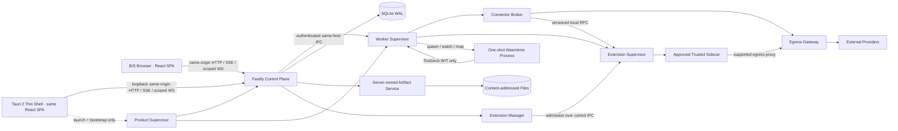
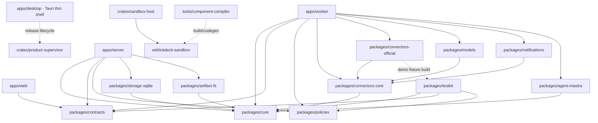

# Architecture Spine — TickDeck

## Design Paradigm

TickDeck 采用 **Hexagonal Modular Monolith + Supervised Execution Plane**：Fastify 控制面是状态、策略、Gate 与审计的唯一权威；可重启的 Worker Supervisor 承载连接器、模型、通知和 Agent 编排；每次用户脚本编译或运行都进入一次性 Wasmtime 子进程。B/S 与 Tauri 2 桌面客户端只是同一 React SPA 的两个入口，不产生第二套业务内核。各层只通过版本化端口通信，所有产品进程位于同一主机。



## Open Decisions and Revisit Gates

| Item | State / Revisit Gate |
| --- | --- |
| OQ-01 演示数据来源与许可 | **RESOLVED 2026-08-28：** 官方 demo 只使用固定版本、固定种子的确定性合成数据，不打包第三方真实历史行情；始终标记 `demo/non-current`，不得替代真实数据资格。 |
| OQ-02 Alpha 用户与冻结基线任务 | **RESOLVED 2026-08-28：** 协议固定为至少 12 名合格用户、覆盖 A/港股合法数据使用者、每人至少两次同类真实任务并分别使用现有工具链与 TickDeck，且任务/oracle/盲审/基线预先冻结；协议关闭不代表招募或 SM-00 已完成，有效证据仍阻塞 S2。 |
| OQ-03 首批免费 A/港股连接器 | 继续阻塞 S1；为两市场选择并验证合法免费路径，通过 §6.4 资格测试后注册；免费路径不合格时收窄市场或保持 beta，不得静默改用商用源。部署者可主动选配经同等验证的商用连接器。 |
| OQ-04 公共发布法律文本 | 公开 beta 前由项目维护者核对；本架构不构成法律意见。 |
| OQ-05 性能参考环境 | 首轮 alpha 基准后复核；保留原基线、环境和调整理由。 |
| OQ-06 实施证据余项 | 平台、隔离边界与终止机制已由 AD-12 决定；S0 必须锁定 TypeScript compiler/componentizer/source-map 组合，并在五平台通过 FR-095/NFR-037 后才能注册能力。 |
| OQ-07 备份维护者 | **RETIRED 2026-08-28：** 不要求强制备份维护者，ID 不复用；至少一名明确项目维护者及发布/安全响应演练要求继续有效。 |
| 五平台最低 OS/libc/system WebView 版本 | 由 S0 release spike 基于实际 B/S archive、桌面 envelope 与 CI 证据写入 Release Profile；不得改变五个 profile 或静默降级。 |
| Vault 加密库、KDF 与 headless secret-file 格式 | S0 安全设计评审固定精确算法、库版本、轮换与迁移格式；不得改变 AD-9 的独立 Vault、外部根密钥与 `LOCKED` fail-closed 边界。 |
| 权威十进制实现 | **RESOLVED 2026-08-28：** 采用 AD-31 的 `decimal.js` 10.6.0、34 位有效数字、`ROUND_HALF_EVEN`、规范十进制字符串和版本化领域量化规则；实现与证据仍受对应阶段 Gate。 |
| 具体模型、通知和官方连接器清单 | 各阶段按资格、许可、manifest 和 Gate 单独选择；接口存在不等于能力已授权。 |
| B/S + 桌面发布与 bootstrap 机制 | **RESOLVED 2026-08-28：** 采用 AD-30 的一个 product payload、B/S 与 Tauri 2 两个入口、共同 product-supervisor、单次会话 bootstrap、签名信任与升级状态机；五平台安装/升级/回滚/恢复证据仍是发布 Gate。 |

## Invariants & Rules

导航索引：AD-1–AD-4 定义权威、状态、事务与恢复；AD-5–AD-11 定义授权、会话、数据使用、出站、连接器、持久化与备份；AD-12 定义沙箱隔离与终止；AD-13–AD-17 定义客户端权威、Agent 边界与 UX 合同；AD-18–AD-22 定义发布、审计、验证、维护与扩展；AD-23–AD-29 定义领域语义、演示/诊断/提醒、RPC、市场身份与拨号前授权；AD-30 固定 B/S 与桌面双入口的共同交付边界；AD-31 固定全产品权威金融数值语义；AD-32 固定项目骨架的跨语言工程质量合同。全部 AD 同时受后文 Consistency Conventions 约束。

### AD-1 — 控制面与执行面分离 [ADOPTED]

- **Binds:** 全部能力；FR-070–FR-083、FR-096–FR-100；NFR-008–NFR-010、NFR-016、NFR-026–NFR-028
- **Prevents:** Web、连接器、Agent、沙箱或独立 Worker 各自形成状态权威；为本地自托管过早拆成微服务。
- **Rule:** Fastify 控制面拥有受保护会话、命令校验、状态机、Gate、策略、持久化、审计、outbox 和持久任务准入。Worker Supervisor 是同主机、可重启的受信执行进程，只通过版本化端口领取租约和提交结果；Linux/macOS 使用权限收紧的 Unix domain socket，Windows 使用带 ACL 的 named pipe，均叠加每次启动轮换的 Worker credential 与协议版本校验。连接器、模型、通知与沙箱均不得绕过控制面成为业务状态权威。v1 只交付单主机拓扑，不引入跨主机协调、服务发现、外部消息代理或容器编排依赖。

### AD-2 — 阶段 Gate 是服务端能力注册表 [ADOPTED]

段内路标：Gate authority → 假设与范围 → 阶段矩阵 → UI 投影。

- **Binds:** S0-V–S5；FR-084–FR-100；全部 UX 表面；OQ-02、OQ-03、OQ-06
- **Prevents:** UI feature flag、模型、扩展、直接改库或演示页面提前解锁后续阶段能力。
- **Rule:** **Gate authority.** 能力严格按 `S0-V → S0 → S1 → S2 → S3 → S4 → S5` 依赖顺序开放。Gate Registry 把 PRD §6.6 的“仅实现范围、Go、Stop/Narrow”矩阵作为带 source digest 的不可变规范输入，不得改写为提示或局部勾选。每个构建生成不可变 Capability Manifest；每个 API、工具、Worker handler、连接器和 UI 入口声明所属阶段、前置条件、证据和是否进入构建。未进入构建的能力不注册；已进入但证据不足、过期或漂移的能力保持 `locked` 或 `suspended`。服务端 Gate Registry 是唯一权威，状态转换追加审计。mock、演示、编译成功或厂商声明均不能关闭 Gate。OQ-03 继续阻塞 S1；OQ-02 协议已关闭，但合格招募与有效实验仍阻塞 S2；AD-12 关闭 OQ-06 的技术选择，但沙箱能力仍须通过五平台证据门后才可启用。

**假设与范围。**

A-01、A-02、A-05 保持“未验证产品假设”；架构完成、自动化全绿或竞品能力证据都不能关闭它们。A-03 已 retired，替代为“合法免费数据源默认优先、商用源由部署者主动选配”的产品决策；该决策不降低 §6.4、SM-10 或 Gate。A-04 与 SM-09 已 retired，不再以外部贡献增长证明成功；Apache-2.0、贡献脚手架、四类扩展、SM-15 和维护治理仍为承重合同。Gate 必须保留所有活跃 SM/SM-C 的原阈值、证据、owner 和失败动作；SM-00 未通过即停止平台化，S5 只有全部 v1.0 SM/NFR 通过才可发布 v1.0。

`packages/contracts` 中的 canonical capability catalog 是 capability ID、stage 和 schema 的唯一来源。release build 是 Capability Manifest 的唯一生成方，并从同一 catalog 生成 web、server 和 worker slices。Release Manifest 记录 catalog 与三份 slice 的 digest。任一 slice 缺失、包含额外 capability 或 digest 不一致时，构建与发布必须失败；不得以运行期降级掩盖。

明确排除 v1：用户/组织/RBAC/多租户、SaaS 控制面、跨主机部署、完整 TradingView/全球资产复制、实盘券商执行、无人值守自动交易、模型下载/量化/GPU/推理托管、远程一键扩展安装、公共脚本社区、移动端验收、离线模式和运行期遥测回连。桌面客户端已由 AD-30 正式纳入，但不得扩张这些非目标。

必须经新产品决策才能重开：ETF、期货、期权、外汇、加密资产、美股等新资产类别，自动多模型路由、多 Agent 编排、公共 REST API 与在线扩展市场。这些方向在重开前不得进入 Capability Manifest、API 或扩展兼容承诺。

**阶段矩阵。**

| Stage | Registration ceiling | Go | Stop / Narrow |
| --- | --- | --- | --- |
| S0-V | 一条合法真实数据路径、只读筛选、受限 R0 Agent、固定任务对照；不建设沙箱、提醒或组合。 | SM-00 全部通过。 | 未改善时间、漏错和复用即停止全工具 Agent thesis，不进入平台化建设。 |
| S0 | 演示数据、统一工具/数据契约、Run Manifest、风险策略、沙箱、单工作区访问边界及只承载当前阶段能力的 B/S/桌面双入口壳。 | 契约、权限、双入口等价性、沙箱和恢复基准通过。 | 无法形成安全且可复现的共同运行时即停止全工具 Agent。 |
| S1 | 一条 A 股及一条港股真实路径，完成“打开图表→筛选→证据结果”。 | §6.4 能力画像与许可记录通过。 | 任一市场无合法可用路径即不得承诺 A/港股 v1.0。 |
| S2 | 双市场规范化条件树、证据产物、保存与复跑；单 Agent 只能编排 `stage <= S2` 的工具。 | SM-02、SM-04、SM-10 通过。 | 语义或数据资格不稳定则维持实验，不扩张策略能力。 |
| S3 | TypeScript 策略、沙箱回测、偏差矩阵与语义基准。 | SM-03、SM-05、SM-07、SM-11 通过。 | 只能编译而不能通过行为基准即停止自动策略生成。 |
| S4 | 提醒、组合、模拟订单、审计与数据生命周期。 | SM-06、SM-12–SM-14、SM-16 通过。 | 不能证明副作用一致性和市场规则正确即不启用 Agent 模拟交易。 |
| S5 | 八组能力、Parity Rubric、双语、可访问性、备份、扩展与治理。 | 全部 v1.0 SM/NFR 通过。 | 未通过项保持 beta，不以 v1.0 发布。 |

**UI 投影。**

Capability Manifest 的 UI 表面阶段必须直接取自 UX 合同：S0-V 可注册 App Shell、Navigation Rail、Trust Strip、阶段适配的 Agent Panel/Run Timeline、Review Canvas、Data Table、Form Control、Status Badge、Empty State、Theme Control；S1 增加 Context Drawer、Chart Canvas、Command Palette、Diagnostic Panel；S2 增加 Risk Gate；S3 增加 Monaco；S4 增加 Notification Center。早期 shell 只能展示该阶段已注册的状态与工具。

UI route/navigation item 只有在所属 Gate 为 passed 时才可 mount；`locked`/`suspended` 仅在运行与健康诊断中可见，不得渲染为 disabled menu、lock teaser 或 placeholder page。一级壳只分“研究”和“系统”：研究含筛选、工作台、策略实验室、提醒、模拟组合；系统含运行与健康、连接与模型、通知中心、扩展，均按最早阶段出现。自选、基本面、公司行动、资讯、绘图和指标属于工作台上下文。Agent 只能是右侧伴随面板，run 是运行历史实体，不设一级导航。Review Canvas 是中央 overlay/view，关闭时按 UX 合同恢复进入前的 object、time range、zoom、panel widths、expanded items 与 scroll position。

### AD-3 — 领域状态只有一个所有者与一条写入路径 [ADOPTED]

- **Binds:** FR-001–FR-100；NFR-007–NFR-017、NFR-026–NFR-029、NFR-036
- **Prevents:** 两个遵守模块边界的实现仍因重复实体、并行写路径或本地缓存成为权威而发生分叉。
- **Rule:** `packages/core` 唯一定义领域实体、值对象、状态机、命令语义和端口；`packages/contracts` 唯一定义版本化传输 schema、事件 envelope 与错误代码，服务端和前端从其生成类型。每类可变领域数据只有一个控制面 command handler；所有写入携带 `idempotency_key` 与 `expected_state_version`，经控制面事务提交。Worker、Web、sidecar、Connector、Agent 与沙箱不得直接修改领域表；浏览器缓存、流和工件都不是状态权威。

所有入口先映射到同一个 canonical action registry。`OperationIdentity` 固定为 `workspace_generation + subject + canonical_action_id + idempotency_key`，并绑定 RFC 8785 canonical parameter digest；同 identity、不同 digest 返回稳定 conflict，不能新建 operation。HTTP、Agent tool、scheduler 与 recovery 共享该表和首次 operation/result。非敏感 operation tombstone 在 workspace 生命周期内保留；DataUse 删除可移除 payload，但不得删除阻止重放所需的 identity、digest、状态与审计引用。

### AD-4 — 事务、outbox 与租约共同定义一致性 [ADOPTED]

- **Binds:** FR-025–FR-028、FR-029–FR-051、FR-052–FR-064、FR-073–FR-076、FR-091–FR-096；NFR-006–NFR-012、NFR-017、NFR-036
- **Prevents:** 事务中调用外部服务、崩溃后重复业务副作用、旧 Worker 覆盖新结果或把不确定执行当失败重试。
- **Rule:** 权威命令必须在一个串行 SQLite 写事务中完成以下操作后提交：校验状态、Gate 和授权；占用唯一 operation 与幂等键；写入领域变更、不可变审计和 outbox/job。事务内禁止外部副作用。`packages/core` 只有一个版本化 RunContext discriminated schema，控制面只有一个 factory/validator，并在入队事务中冻结它。common envelope 必须包含 workspace generation、build/capability/Gate、subject、locale/timezone、data snapshot、policy/risk、budget 与授权引用；各 run kind 以 schema 声明 execution assumption、script/compiler/WIT、model/prompt/toolset、portfolio 等字段为 required 或 not-applicable。所有 mutable reference 都携带 immutable snapshot/version；RunContext 使用 RFC 8785 canonical serialization 计算 digest，R2、audit、job、artifact 与 recovery 只引用该 digest。

任务使用心跳租约和单调递增 fencing epoch，旧 epoch 的结果必须拒绝。纯计算或沙箱计算可按同一 operation、新 attempt、同一 RunContext 重排；外部副作用前持久化 `DISPATCHING`，其后崩溃且无结果时进入 `UNCERTAIN`，不得盲重试。唯一约束保证模拟订单等业务效果最多一次；投递可重复，业务效果不可重复。

运行状态固定为 `QUEUED | LEASED | RUNNING | WAITING | PAUSED | SUCCEEDED | FAILED | CANCELED | INTERRUPTED | UNCERTAIN`。`WAITING` 表示等待 R1/R2/必要输入，`PAUSED` 表示操作者、policy 或 budget 暂停；二者没有活跃执行租约，恢复时必须重验并经 `QUEUED` 取得新 fencing epoch。`recovered` 是恢复 provenance/event，不是终态；`running-disconnected` 是客户端 connectivity projection，权威状态仍为 `RUNNING`。Run projection 保存 last event cursor、last successful step/time 与 recovery decision。取消先持久化再发信号；会话或浏览器断开不取消任务。工件持久状态只使用 AD-10 的 canonical enum；UI 可把它映射为简化标签，但该映射不具权威性。

### AD-5 — R1/R2 授权绑定状态，R2 永不重放 [ADOPTED]

- **Binds:** FR-057–FR-064、FR-091–FR-093；NFR-009、NFR-017、NFR-035–NFR-036；Risk Gate UX
- **Prevents:** 双击、刷新、多标签页、网络重试、参数替换或状态变化产生第二次高风险操作。
- **Rule:** R1 是可撤销、可过期、可复用的范围授权，绑定受保护 subject/workspace、tool/action、object/scope、参数约束、状态约束、策略摘要与有效期；每个 operation 仍须重新校验当前状态、策略、预算和 revocation。R1 永远不能覆盖 R2 类别：覆盖/删除产物、启用外部通知、高成本运行、向新外部服务发送数据、启用策略和每笔模拟订单。

R2 是服务端签发的高熵、不透明、单次 Grant，数据库只存其摘要。R2 绑定会话主体、workspace、run/object、`tool@version`、完整规范化参数摘要、snapshot/manifest ID、数据 nature/freshness/completeness、portfolio version、其他相关状态版本、DataUsePolicy/EgressPolicy judgment 摘要、预计 cost/egress/portfolio impact、nonce、签发/过期时间和 `max_uses=1`。任一绑定字段变化时，必须在同一事务中将 Grant 标记为 `r2-state-changed` 并使其失效。确认 read model 必须显示上述绑定摘要、有效期及消费前可撤销状态。消费必须在 `BEGIN IMMEDIATE` 内原子校验 Grant、状态与策略，标记 consumed，并创建唯一 operation、审计和 outbox。presented、confirmed/declined、invalidated/expired、blocked、consumed、result 与 recovery 必须是独立审计事件，不得合成一个 success。提交后即使执行失败也保持 consumed；outbox 只能续跑原 operation。外部效果不确定时转 `UNCERTAIN`；再次尝试必须重新校验并取得新确认。Grant 不得进入 URL、日志、工件或通知。

### AD-6 — 单工作区仍必须使用受保护会话 [ADOPTED]

- **Binds:** FR-070–FR-072、FR-088–FR-090；NFR-013–NFR-015、NFR-033
- **Prevents:** 把 localhost、反向代理头或内网位置误当身份；DNS rebinding、CSRF 与跨站 WebSocket 绕过。
- **Rule:** 产品没有用户、组织和 RBAC，但每个工作区必须有受保护会话；UI 与部署指南必须明确告知，经代理进入实例的所有人共享同一权限和数据。本地模式只绑定 loopback，并为每次启动生成非秘密的随机 `<instance>.tickdeck.localhost:<port>` origin 与精确 Host allowlist，避免 host-only cookie 与其他 localhost 服务共享。它使用不落日志的单次 bootstrap：本地 B/S 由 TTY 显示一次性配对码，用户在该 loopback origin 页面提交，禁止把秘密放入 URL；桌面模式由 product-supervisor 经 inherited pipe 把秘密交给受信 Tauri Rust，后者以原生 loopback 请求换取绑定该 origin 的 host-only、HttpOnly、SameSite=Strict session cookie，写入 WebView cookie store、清零交接材料后再导航。秘密不得进入 argv、environment、URL、日志或 Web JavaScript。远端模式使用一个 workspace admin secret，经 HTTPS 或明确的 trusted proxy source 进入，且不得旁路直连上游端口。部署代理负责 TLS、外层 access log 与 rate limit；TickDeck 只接受精确 proxy source 的转发头，验证后的代理 identity 仅作审计归因，不得变成用户、角色或授权维度。会话 token 高熵、不透明，仅以摘要、主体、到期和撤销状态存 SQLite；远端 cookie 必须 Secure。所有 mutation 校验 session、CSRF、Host 与 Origin；Host 使用显式 allowlist。WebSocket 使用短期单次 ticket 并校验 Origin。会话有 idle/absolute expiry，丢失会话或关闭任一客户端不取消已提交任务。

已有本地实例只能通过 owner-only control IPC 接管：Unix domain socket 同时校验 peer UID，Windows named pipe 同时校验 peer SID；同一 UID/SID 是本地模式的唯一 OS security principal，不得由路径、PID、lock 文件内容或“来自 localhost”替代。新 launcher 先对同一 `WorkspaceIdentity` 获取文件锁；锁被占用时读取的 `InstanceDescriptor` 只用于 rendezvous，必须再通过 IPC protocol/release digest、peer principal、workspace UUID、boot nonce challenge 与健康校验。完全匹配时，现有 supervisor 为本地 B/S 生成新的 TTY 配对码，或经该 IPC 向受信 Tauri Rust 返回单次 bootstrap secret；其余情况以稳定 `INSTANCE_PRINCIPAL_MISMATCH | INSTANCE_RELEASE_MISMATCH | INSTANCE_UNHEALTHY` 拒绝，不启动第二写入者。lock 内不得存 session 或 bootstrap secret；进程死亡由 OS 释放锁，后来者只有实际取得锁后才可重写旧 descriptor。

### AD-7 — DataUsePolicy 随数据衍生传播 [ADOPTED]

- **Binds:** FR-001–FR-007、FR-073–FR-076、FR-084–FR-087、FR-096；NFR-008、NFR-012–NFR-015、NFR-032、NFR-038
- **Prevents:** 合法获取被误当作任意模型输入、导出或备份许可；派生物绕过源数据限制。
- **Rule:** `packages/policies` 提供版本化、声明式、服务端 DataUsePolicy 编译器，将 connector authorization purpose/expiry、deployment scope、数据类别和目标 action 归一为 `ALLOW | DENY(reason)`；未知、冲突、不可验证或过期一律拒绝。多个来源及其派生物取最严格交集，并传播到索引、筛选、回测、报告、模型输入、导出和备份。RunContext 记录策略版本与摘要，执行时再次校验。模型、扩展与连接器只能收紧，不能放宽。资产清单持久记录 provenance、lineage、expiry 和 downstreams；到期后清理或隔离受限数据，并把受影响产物标为不可完全复现。策略不得使用可执行脚本。

### AD-8 — 所有外部网络流量经过 Egress Gateway [ADOPTED]

- **Binds:** FR-001–FR-007、FR-025–FR-028、FR-065–FR-069、FR-077–FR-083、FR-088–FR-090；NFR-013–NFR-015、NFR-034
- **Prevents:** SSRF、DNS rebinding、云元数据访问、危险重定向、跨主机凭据泄漏和连接器私开 socket。
- **Rule:** 模型、Webhook、自定义 endpoint 和外部数据连接器只可经 Worker Egress Gateway 出站；其他进程不得开启任意外部 socket。控制面与 `packages/policies` 唯一定义版本化 `ExternalRecipientId` 及 `RecipientApproval` aggregate；identity 规范化 scheme、canonical host、effective port、destination class、provider/profile、tenant/path scope、credential scope 与 redirect policy。manifest 只能引用该 ID，adapter 不得自行判断“新接收方”；DNS/IP 是每次拨号验证证据，不是稳定 recipient identity。

每次请求必须同时通过 DataUsePolicy、精确 `scheme/host/port` allowlist、数据最小化、凭据作用域、请求/字节/时间/成本预算和风险授权。Gateway 解析 DNS 后默认拒绝 loopback、private、link-local、reserved 与云元数据地址，连接已验证 IP；每次受限重定向重新解析和校验，凭据不得跨 host。内网例外必须由操作者明确批准并记录风险，新 `ExternalRecipientId` 仍需 R2。响应始终视为不可信输入；审计只记录脱敏元数据。同主机认证 IPC 不属于 egress。

v1 发行管理不自动检查或下载升级，也不在 Tauri、product-supervisor 或 server 中增加第二条外部网络路径。操作者从 TickDeck 之外取得完整签名 release set，再从本地只读路径显式导入；导入后的临时 loopback installer feed 只向受信 Rust 暴露一次，仍须通过 AD-30 的双重验签和摘要校验。未来若增加在线更新获取，必须作为独立 Gate 能力经 Worker Egress Gateway、固定 `ExternalRecipientId` 和显式授权实现；该接口预留不代表 v1 已授权。

### AD-9 — Connector Broker 隔离供应商差异与秘密 [ADOPTED]

段内路标：Broker 与 sidecar → retry semantics → 用户配置与 Secret Broker → 模型档案与资格。

- **Binds:** FR-001–FR-007、FR-025–FR-028、FR-065–FR-069、FR-077–FR-083、FR-084–FR-090、FR-097、FR-099；NFR-013–NFR-015、NFR-020、NFR-026–NFR-028、NFR-031、NFR-039
- **Prevents:** 供应商 SDK 污染领域层、运行时加载任意 npm、连接器绕过策略或直接读取 TickDeck 数据库和秘密。
- **Rule:** 所有数据、模型和通知调用通过 Worker 内 Connector Broker；Broker 统一执行 capability、policy、timeout/rate limit、错误归一、健康与 provenance。审计过的 HTTP/file/db 适配器是受信 Worker 模块。必须使用供应商 SDK 时，只能在操作者批准、独立受监督的 trusted sidecar 中运行，通过版本化本地 RPC 接入；sidecar 不得直接访问 TickDeck DB、会话、审计或其他连接器，且外部访问仍经受支持的 Gateway/proxy 并通过绕过测试。manifest 必须声明 capability、destination、SecretRef 需求、data use、协议版本与 `EffectSemantics = PURE | IDEMPOTENT_WITH_KEY | RECONCILABLE | NON_IDEMPOTENT`，并为 `IDEMPOTENT_WITH_KEY`、`RECONCILABLE` 和 `NON_IDEMPOTENT` 声明 provider key 的来源、传输位置、scope、retention、reconcile endpoint 与证据。禁止运行时任意 npm/plugin 加载。

Broker 是唯一 retry owner；sidecar/SDK 内部 retry 必须关闭。无法关闭时，每个 SDK sub-attempt 必须实时上报并沿用同一 provider key；做不到则该 connector 不得获得 effectful action 资格。只有可证明 pre-dispatch failure，或通过 conformance 的 `PURE`/`IDEMPOTENT_WITH_KEY` 才能自动 retry；`RECONCILABLE` 先查询 provider 并记录证据，`NON_IDEMPOTENT` 及任何 sent-without-ack 直接进入 `UNCERTAIN`，不得重发。

用户在 TickDeck 的“连接与模型”界面创建、测试、查看遮罩状态、检查依赖、轮换、撤销和删除 endpoint/API key。秘密立即写入独立加密 Vault；SQLite 只存 SecretRef 元数据。根 wrapping/unlock key 必须来自 Windows Credential Manager、macOS Keychain、Linux Secret Service，或 headless 环境的受限 secret file/orchestrator secret；缺失时进入 `LOCKED`，不得明文降级。SecretRef 只在策略通过后按最小范围解析，秘密不得进入 outbox、job、工件、日志或模型上下文。

控制面内的 Secret Broker 是 Vault mutation、platform key-store access 与 plaintext resolution 的唯一 owner。创建/轮换生成不可变 `SecretVersion` 并原子切换 active pointer；rotate/revoke 递增 secret epoch。Worker 只能在策略通过后经认证 IPC 取得绑定 `operation_id + secret_version + epoch + expiry` 的内存 lease；禁止跨 operation、connector pool 或持久介质缓存 plaintext。sidecar 只接收本次调用的短期注入，不得访问 Vault 或平台 key store。旧 epoch 的 queued work 拒绝并重验；已经 dispatch 的外部效果按 AD-4 进入成功、失败或 `UNCERTAIN`，不得用新秘密盲重发。

模型档案最少包含 provider、Base URL、API key SecretRef、Model ID、custom header SecretRefs、timeout、retry、context length、pricing 与 default parameters。精确 provider/model/prompt/toolset 组合进入 RunContext；不得静默切换 provider。fallback 必须是另行配置、重新资格验证且在 DataUse/Egress 与成本界面可见的新 action。本地模型只作为操作者自行运行的兼容 endpoint；TickDeck 不下载、量化或管理模型、GPU 与推理服务。

Wind、Choice、iFinD 当前均不得宣称 supported；只有真实账户、合同和部署测试覆盖字段、entitlement、rate limit、断线重连、缓存、远端部署及各 DataUse action 后才能改变资格状态。未经明确再分发许可，任何供应商二进制不得进入 Apache 发布物。

### AD-10 — SQLite 是唯一数据库，工件是同主机内容寻址文件 [ADOPTED]

- **Binds:** FR-001–FR-100；NFR-007–NFR-012、NFR-017、NFR-029、NFR-036、NFR-038
- **Prevents:** 同一实体在数据库、Worker 文件和浏览器缓存中出现多个权威副本；误建跨数据库兼容层或共享文件路径权限。
- **Rule:** 本地和远端自托管都使用单主机 SQLite WAL；控制面是领域数据库与 Artifact Service 的唯一访问者，也是 `packages/artifact-fs` 的唯一调用者。SQLite 保存状态、配置、jobs、leases、policy、audit、outbox 与 Artifact Manifest。不可变数据集、运行输出、报告附件和大工件进入同主机内容寻址文件库；manifest 记录 digest、size、media/schema、sensitivity 与 retention。Worker、connector、sidecar 与 sandbox 只能经认证 IPC 请求 stage/read/commit，不接触路径或直接 promote。

Artifact 状态机固定为 `STAGING → VERIFIED_UNCOMMITTED → COMMITTED → QUARANTINED | DELETED`，每一步由控制面以 operation/lease 关联。服务端写 temp、校验 digest/size、durable flush、atomic promote 后记录 verify receipt；只有在同一领域事务把 Manifest 置 `COMMITTED` 后，领域记录才可引用它。promote 后、commit 前崩溃留下的 blob 是可恢复 verified candidate 或 orphan，绝非权威；有 Manifest 无 blob 时 fail closed 并 quarantine。控制面负责 staging cleanup 与 orphan scan；GC 只删除无 committed reference/live pin 的对象。备份 pin 在取得逻辑快照的同一 SQLite 事务中创建并带 generation/lease；DataUse 强制清理优先于普通 pin，排除 payload 并保留 non-reproducible marker。v1 不提供其他数据库、网络文件系统或远程对象存储后端。

控制面为每个调用签发短期、不可转移的 `ArtifactCapability`，绑定 peer instance/role、operation、RunContext digest、workspace generation、允许的 input digests/output slots、`read | stage | finalize` verbs、media/size quota、DataUse judgment、expiry 与 fencing epoch。Artifact Service 逐请求校验；裸 operation ID 或 digest 不授予访问。每次实际 read/finalize 写入 usage ledger，输出 lineage 由控制面按实际读取集合取最严格 policy 交集，不接受 Worker/模型自报。

### AD-11 — 备份/恢复是一致性与权限重置操作 [ADOPTED]

- **Binds:** FR-073–FR-076、FR-087、FR-096；NFR-010–NFR-012、NFR-032、NFR-038
- **Prevents:** 备份泄露秘密或受限数据；恢复后旧会话、Grant、租约和 Worker 结果继续生效；不确定副作用被重发。
- **Rule:** 备份是版本化 workspace bundle：从一致 SQLite 逻辑快照生成，只 pin `COMMITTED` Manifest 所引用的 immutable blob，并对 manifest、parts、audit、config 与 artifacts 做摘要。DataUsePolicy 逐类逐 action 过滤；禁出 payload 排除，但保留非敏感 provenance、reason 与 non-reproducible 标记。默认备份排除 Vault、session、bootstrap、CSRF、R1/R2；秘密仅能独立加密导出。恢复先进入临时 workspace，完成 schema/compatibility/integrity 校验后原子切换，并生成新的 `workspace_generation`，使旧 session、grant、lease 与 worker result 全部失效。未完成内部任务转 `INTERRUPTED`；已 dispatch 但结果不明的任务转 `UNCERTAIN`，outbox 在分类完成前保持。SecretRef 必须重验，解锁前 egress 关闭。

### AD-12 — OQ-06 采用 Wasmtime Component 双层终止边界 [ADOPTED]

段内路标：guest 隔离 → 资源档案 → 终止机制 → 平台证据。

- **Binds:** OQ-06；FR-029–FR-043、FR-077–FR-083、FR-095；NFR-007、NFR-013、NFR-016、NFR-018、NFR-037、NFR-039；SM-07
- **Prevents:** 用户 TypeScript 继承 Node 权限；仅靠语言 VM 超时；杀死任务却遗留子进程；平台间静默降级为较弱隔离。
- **Rule:** 用户受限 TypeScript 必须先编译为 WebAssembly Component，再由一次性 Wasmtime runner 执行；每次 compile/run 都由一个一次性 `sandbox-host` supervisor 进程托管。guest 不提供 Node API、任意 npm、filesystem、network、environment、process 或 system import，只能调用版本化 TickDeck WIT capability。Wasmtime Store 设置 per-linear-memory、memory count、table、instance、fuel、epoch 与 host-call/I/O limits；这些只算 guest/runtime resource，不冒充整个进程内存。

默认档案为：编译 wall clock 10 秒；指标预览 wall clock 5 秒、guest linear memory 512 MiB、output 10 MiB；策略回测 wall clock 60 秒、guest linear memory 1 GiB、output 50 MiB。每个 Release Profile 还必须锁定 source/component/input、memory/table/instance count、compile artifact、host-call allocation 与 process memory budget 的非零硬上限。Windows supervisor 使用 Job Object 的 job/process memory limit 与 `KILL_ON_JOB_CLOSE`；Linux/macOS supervisor 使用经该 profile 证明可用的 OS address/data limit，并叠加高频 RSS sampling。采样限制不得描述为 byte-exact hard cap；profile 必须记录 sampling interval 与 suite 实测的最大 overshoot，不能证明有界 overshoot的平台不得发布支持。

Worker watchdog 超时或 memory violation 后必须终止并回收整个进程树：Linux/macOS 使用独立 process group/session，越过 grace period 后杀死 group 并 wait/reap；Windows 终止 Job 并等待句柄完成。`sandbox-host` 是唯一能够承载 Wasmtime 和执行不可信代码的 Rust binary，包含 supervisor 与 runner 两种窄模式；AD-30 的 Rust product-supervisor/Tauri shell 只处理受信发行生命周期与窗口，不得加载 WIT guest、实现领域命令或获得 DB/Secret/Artifact 权限。compile-time/runtime memory exhaustion、解析/实例化放大和 host-allocation fixture 必须证明 server/worker 存活，子进程以稳定 `RESOURCE_LIMIT_*` 分类退出。架构可收紧或增加经 R2 确认的版本化高成本档案，但每一维都不得关闭硬上限。

支持矩阵固定为 Linux x86_64、Linux ARM64、Windows x86_64、macOS Intel x86_64、macOS Apple Silicon ARM64；Windows ARM 不在承诺内。Release Profile 记录 Wasmtime upstream tier，ARM64 不得借 Tier 2 降低 TickDeck 自有证据。五个平台运行同一固定版本 FR-095/NFR-037 合规套件；任一平台失败即该发布不支持该平台，不得回退到更弱执行方式。TypeScript compiler/componentizer 的精确组合、WIT/WASI versions、最终 Component imports、源码映射和确定性输出必须在 S0 spike 中锁定；构建后拒绝所有非 TickDeck WIT import，并通过全矩阵 source-map/error fixture。失败时保持能力未注册，不提供较弱 fallback。

### AD-13 — HTTP 快照权威，事件流只负责通知变化 [ADOPTED]

- **Binds:** FR-001–FR-100；NFR-001–NFR-015、NFR-020–NFR-024；全部 UX 状态合同
- **Prevents:** React、SSE、WebSocket 与服务端各持一套状态机；重连丢事件后界面静默过期。
- **Rule:** React 与 Fastify 共享生成的 TypeScript/JSON Schema。传输契约固定 JSON Schema Draft 7，并只允许 `packages/contracts` 审核过的标准关键字；禁止后续 draft-only、TypeBox JavaScript-only construct、async/custom keyword。版本化 `ContractAjvProfile` 在浏览器与 Fastify command body 同时固定 Ajv 8.20.0、strict/strictSchema/strictTypes、`allErrors: true`、`coerceTypes: false`、`useDefaults: false`、`removeAdditional: false`、`validateFormats: true`、`$data: false`、无 async keyword，并注册同一 `ajv-formats` 集合。URL query/path parsing 是独立显式 adapter，不得改变 canonical JSON body 语义。

内部 API 使用 HTTP query/command；mutation 携带幂等键与 expected state version。持久有序事件使用带 event ID 的 resumable SSE；只有通过阶段与保护门的高频行情使用 WebSocket。SSE/WS 仅通知变化，HTTP snapshot 是权威；序号缺口必须重新取快照。RunContext 创建后不可变。错误 envelope 固定包含稳定英文 code、参数化 explanation、retryability、operation state 与 next action。v1 不承诺公共 REST 或第三方兼容 API。

服务端提供版本化 presentation read model，客户端只本地化标签，不得合成或放宽状态。Trust 状态同时包含 provenance/source、as-of/data time、freshness、`real | delayed | demo | partial`、`fresh | stale | missing | unsupported | unknown`、qualification/Gate 与 impact 参数；数据驱动表面常驻最小 Trust Strip，并在字段附近显示局部降级，未获资格的 provider 不得显示为 supported/healthy。Risk Gate read model 包含 R0–R3、不可变绑定摘要、expiry/consumption 与 next legal action；pending R2 区域不可折叠，R3 不提供 override。Agent view model 包含冻结 Context Chips 和 `plan | current-step | tool-event | gate | result` 节点。产品内通知记录是权威，Toast 只作瞬时提示。

### AD-14 — Agent 只编排，不拥有权限与计算真值 [ADOPTED]

- **Binds:** FR-052–FR-069、FR-091–FR-094；NFR-007、NFR-013–NFR-017、NFR-028–NFR-029、NFR-035–NFR-036；SM-00、SM-04–SM-06、SM-17
- **Prevents:** Mastra、模型提示或第三方工具绕过领域规则、秘密、Gate 与策略；模型输出来决定财务计算是否正确。
- **Rule:** `packages/agent-mastra` 只实现 Agent orchestration port，不得直接访问 DB、filesystem、network、secret 或 connector。可见工具由当前 build 与 Gate Registry 生成；未授权能力及 R3 工具不注册。每次 tool call 都重新进入 schema、DataUse、Egress、risk、budget 与 state 校验。筛选、收益、指标、回测、订单和风险由确定性领域服务计算，模型只调用工具和解释结果；模型/第三方/tool 内容视为不可信。TickDeck 自己持久化 run、step、call、cost 与 artifact。每个 provider/model/prompt/toolset 组合精确锁定并通过完整资格测试；仅通过 connection/structured-call handshake 的组合最多使用无副作用、单步 R0 查询，不得获得 R1/R2。不存在隐藏长期记忆；可复用状态必须是用户可见、可审计的 config 或 artifact。

所有结果 read model 必须把原始事实、确定性计算、模型解释和 unknown 分开；Agent 不承诺收益、不做投资适当性判断，最终决定始终由用户作出。第三方文本中的指令不得改变 system prompt、工具权限或授权范围。

### AD-15 — 前端是同源 Vite SPA，服务端状态与临时 UI 状态分层 [ADOPTED]

段内路标：SPA 与设计系统 → 合同验证与状态归属 → viewport envelope。

- **Binds:** 全部 UX 合同；FR-008–FR-024、FR-052–FR-076、FR-084–FR-100；NFR-001–NFR-006、NFR-012–NFR-025
- **Prevents:** SSR/第二前端服务增加部署面；Zustand、本地存储或 URL 保存服务器真值、秘密或授权材料；客户端 flags 提前暴露阶段能力。
- **Rule:** `apps/web` 是 Vite React SPA，由 Fastify 同源提供静态资产和 API；不使用 SSR、独立前端 server、CDN、运行期字体或 service worker。UI primitive 固定为 shadcn `base-vega` + Base UI、Tailwind CSS variables、neutral base、Lucide 与本地打包 Inter Variable；初始化命令固定为 `pnpm dlx shadcn@4.19.0 create --preset "https://ui.shadcn.com/init?base=base&style=vega&baseColor=neutral&theme=neutral&iconLibrary=lucide&font=inter&menuAccent=subtle&menuColor=default&radius=default&template=vite" --template vite`。生成后立即提交 resolved preset payload/digest、`components.json`、源码和每个 registry item 的 source digest；CI 禁止 `shadcn@latest` 或重新拉取浮动 registry，升级只能作为 reviewed source diff 进入。字体由 `@fontsource-variable/inter` 随 bundle 提供，禁止运行期网络字体。TickDeck shared theme/component layer 是实现权威；优先组合官方组件，必要时再扩展（compose-before-extend）；只有记录 capability gap 且保持上游无障碍语义时才可扩展，禁止另建平行 primitive。DESIGN.md 的 token、组件与交互表是规范合同。

TickDeck 的 tsconfig 服从 AD-32 的 TypeScript 6.0.3 合同：不使用已弃用的 `baseUrl`、`moduleResolution: node/node10/classic` 或 `ignoreDeprecations`；Web 使用 `module: ESNext`、`moduleResolution: Bundler`、显式 relative `paths` 与完全一致的 Vite alias，Node 服务与工具使用 `module/moduleResolution: NodeNext`。共享 package 通过 workspace package exports 互引，不靠 paths 冒充运行时解析。产品代码不得导入 TypeScript compiler API；只有 `tools/component-compiler` 可以导入并锁定的 6.0.3 API，但该兼容性不替代 OQ-06 对完整 compiler/componentizer/source-map/WIT/WASI 组合的 S0 Gate。S0 必须从空 lockfile 运行 clean install、TypeScript 6.0.3 typecheck 和 Vite build，且 overlay、menu、sidebar、form 的键盘/a11y 回归通过后，starter 才算采用。

路由和阶段模块按能力 code-split，Capability Manifest 中缺失的模块不注册。TanStack Router 只保存可深链的非敏感 URL 状态；TanStack Query 只缓存服务器状态；每个 workbench 的 Zustand store 只保存短生命周期交互状态。React Hook Form 使用 `@hookform/resolvers/ajv` 并传入 AD-13 的同一 `ContractAjvProfile` 与 format set，不使用旧代 `typeboxResolver`；Fastify 通过 custom validator compiler 使用同一 profile。`ajv-errors` 仅作为 resolver 必需的运行依赖，`errorMessage` 不进入允许的传输 schema 关键字集。S0 必须在空 lockfile 环境执行 resolver clean-import，再运行 conformance corpus；corpus 覆盖 coercion、defaults、`additionalProperties`、formats、nullable unions、tuples、`$ref` 与 error normalization，并断言浏览器/服务端的 accept/reject、normalized output 和推导类型一致。长草稿进入服务端 Draft API，秘密、认证与 R2 从不进入草稿。localStorage 只存版本化、非敏感 UI 偏好；不得把行情、组合、模型、SecretRef 值、session 或 grant 放入 localStorage/IndexedDB。

桌面验收下限为 `1280×720`：`≥1600px` 可同时显示 Context Drawer 与 Agent；`1280–1599px` 默认收起 Context Drawer；`<1280px` 使用单面板 focus mode，但不进入 v1 移动验收。Chart Canvas 最小宽度 640px；在支持 viewport 内不得裁切或省略 R2、错误、权限或数据状态。Drawer/Agent 宽度只作为用户可调的非敏感 UI 偏好。

### AD-16 — 图表、表格与编辑器通过 TickDeck 领域适配层 [ADOPTED]

- **Binds:** FR-008–FR-024、FR-029–FR-043、FR-094–FR-095、FR-098；NFR-003–NFR-005、NFR-007、NFR-012–NFR-013、NFR-021–NFR-022、NFR-029
- **Prevents:** 第三方组件序列化格式进入持久模型；Canvas 成为唯一数据表达；浏览器执行用户脚本或计算权威结果。
- **Rule:** 图表使用 Lightweight Charts 5.2.1，经 TickDeck `ChartModel`/adapter 接入；使用原生/custom series 与受控 primitives，持久化 TickDeck schema 而非库对象。计算在服务端或 sandbox，浏览器只渲染；不得以 per-bar React state 驱动。交互状态按 animation frame 合并；行情 HTTP snapshot 带 sequence，WS delta 缺口重载。Canvas 必须有键盘操作及同步 Data Window/表格作为非 Canvas 表达。

表格使用 TanStack Table + TanStack Virtual，并以 shadcn/Base UI 封装；小表保留语义 table，大表使用服务端 sort/filter/cursor 与已加载页虚拟化。row ID 稳定，数据版本变化时游标和选择显式失效；提供不虚拟化的可访问分页模式。partial/stale/missing/unsupported/unknown 在字段附近显示；导出只由服务端执行 DataUsePolicy。

不得引入商业 grid 或另一套自研 table primitive。S1 必须对 A/港股 time scale、未完成 bar、panes/crosshair、绘图、键盘、主题和性能运行 Lightweight Charts spike；若失败，重开 chart engine 选择而不是削弱 FR/NFR 或可访问性合同。

Monaco 仅在 S3 懒加载且资源/worker 本地打包；允许的 `.d.ts` 从脚本/WIT 契约生成，不暴露 Node/fs/net/env/任意 npm 类型。浏览器诊断仅供编辑反馈；锁定的服务端编译、capability 检查、trial 与 sandbox 才是权威，且保留 source map。保存携带 expected version，冲突显示 diff；autosave draft 与 FR-034 正式版本分离。浏览器不得执行脚本。

### AD-17 — 双语、格式化与无障碍是契约，不是页面补丁 [ADOPTED]

- **Binds:** 全部 UX 合同；NFR-021–NFR-025
- **Prevents:** 服务端返回本地化自由文本、数值显示规则漂移、Canvas/虚拟化破坏键盘与读屏、语言切换丢工作状态。
- **Rule:** i18next/react-i18next 打包 `zh-CN`、`en-US` 与 pseudo-long 测试资源；路由按 namespace 分包并使用 typed stable keys。语言来自浏览器或用户偏好，切换不得重置状态；页面 `lang`、来源原文和 Agent 输出语言必须显式。服务端只返回稳定英文 code 与参数，客户端本地化。`FinanceFormatter` 统一领域精度、币种、舍入和明确时区，`Intl` 只做展示。外部内容不得自动翻译或调用在线翻译。

所有核心旅程达到 WCAG 2.2 AA；颜色之外必须有文字/图标/形态，Canvas 与虚拟化必须有等价键盘和可访问表达。light/dark/system 是等价主题；A/港股红涨绿跌不得复用为 success/failure，data nature、availability、system health 与 R0–R3 使用独立语义 token。共享的 `focus-visible` 指示样式至少等效于 2 px，offset 为 2 px，且与相邻颜色的对比度至少为 3:1；交互目标至少为 `24×24px`。风险、权限、数据与确认文本不得截断。

### AD-18 — 发布物自包含且升级可回退 [ADOPTED]

- **Binds:** FR-070–FR-083、FR-095–FR-100；NFR-001、NFR-010–NFR-012、NFR-018–NFR-019、NFR-022–NFR-025、NFR-026–NFR-040
- **Prevents:** 用户自行拼装 Node/Wasmtime/编译器导致版本漂移；升级半迁移；五个平台名义支持、实际行为不同。
- **Rule:** 每个支持 profile 生成一个内容与 digest 一致的 product payload，包含 web、server、worker、managed Node、Rust sandbox-host 与嵌入 Wasmtime、锁定 compiler/WIT、migrations 和 connector manifests；同一 payload 同时进入签名 B/S archive 与 AD-30 的 Tauri 桌面 envelope。`product-supervisor` 属于受信 launcher 层，不进入可切换 payload；B/S bootstrap 与 Tauri 壳从同一 crate 构建，并只启动 Release Manifest 绑定的 payload。product-supervisor 管理单例 data root、进程生命周期、health、优雅停止及残留进程回收；同一 payload 以 ingress/entrypoint 配置区分桌面、本地 B/S 与远端 B/S。Tauri 使用平台系统 WebView，不把 WebView 冒充为随包 runtime；最低版本必须进入 Release Profile 并通过证据 Gate。Release Manifest 固定 release sequence/ID、payload 与 launcher digest、artifact hash、SBOM、compatibility、schema、redistribution evidence、third-party notices 与 sandbox evidence；存在已知 severe 依赖漏洞、缺失再分发权/NOTICE 或缺失锁定 manifest 时不得发布，已受影响能力可由 Gate Registry suspend。Lightweight Charts 5.2.1 的 tagged NOTICE 必须进入每个 bundle，并在双语、双主题可访问的 About/Licenses 表面识别 TradingView、链接其项目；Mastra 只允许 Apache-2.0 package/source boundary，`ee/` enterprise code 不得进入发行物。升级只能显式触发并遵循 AD-30 的共同 `UpgradeCoordinator`；失败必须恢复上一组已签名 launcher/payload 与升级前数据。不可逆迁移只能从升级前备份回退。五个 profile 的 B/S 与桌面入口均须通过安装、启动、升级、回滚、恢复、沙箱终止和卸载保留数据测试；不得依赖系统另装容器、系统 sandbox、Node、Wasmtime 或编译器。

### AD-19 — 审计账本可验篡改但不宣称防 root 篡改 [ADOPTED]

- **Binds:** FR-057–FR-064、FR-073–FR-083、FR-091–FR-097、FR-099–FR-100；NFR-014–NFR-020、NFR-035–NFR-040
- **Prevents:** 用可轮转日志替代权威审计；删除、插入或改写历史事件后无法发现；夸大单机 root 权限下的安全保证。
- **Rule:** Audit Ledger 与运行日志分离且只追加；每条记录包含连续 `seq`、前条 digest、规范化 event digest 和当前 digest，状态、授权、策略、Gate、连接器、SecretRef、恢复、备份与 R2 事件都在对应权威事务中追加。记录只含版本、ID、原因与脱敏摘要，不含秘密或受限 payload。启动、备份 checkpoint 与恢复时验证哈希链；应用层只暴露 append/verify 接口。该机制是 tamper-evident，不是对拥有主机 root 权限者的 tamper-proof 保证；v1 不依赖外部锚点。默认遥测关闭，未来遥测必须另过 DataUse/Egress Gate。

### AD-20 — 验收覆盖真实浏览器与高风险状态机 [ADOPTED]

- **Binds:** 全部 FR/NFR；SM-00、SM-01、SM-01R、SM-02–SM-08、SM-10–SM-17、SM-C01–SM-C08；全部 UX 合同
- **Prevents:** 只用单元测试、模拟浏览器或覆盖率数字替代跨平台、无障碍、安全和恢复证据。
- **Rule:** Vitest/Testing Library 覆盖纯逻辑与组件，Storybook React/Vite + axe 覆盖交互状态，MSW 只模拟协议边界，Playwright 覆盖端到端旅程。图表 adapter 与渲染分层测试，表格同时测试语义/虚拟化路径；R2、session、SSE gap、lease fencing、recovery 与 `UNCERTAIN` 必须有故障注入 E2E。PR 使用代表性 pairwise UX 矩阵，release 运行完整 delivery surface（B/S/desktop）×语言×主题×viewport×数据状态×浏览器或系统 WebView 矩阵。双入口等价性套件必须对同一 profile 的 exact payload digest、Capability Manifest、fixture bundle、test vector 与 oracle digest，分别从同一只读 seed 克隆出的工作区运行 B/S 与桌面入口；验收规范化 API/read model、command/event/audit 结果及关键旅程等价，不用两套可各自变绿的快照。视觉基线归仓库管理，不依赖云服务。自动 a11y 之外必须有键盘与读屏人工验收。B/S 以真实当前及前两个主要版本 Chrome、Edge、Firefox、Safari 验证；桌面以五个 Release Profile 的真实系统 WebView 验证，不以 Playwright bundled browser 代替。Linux ARM64 profile 的发布关闭必须在原生 ARM64 runner 上完成安装、启动、升级、回滚、UI 和沙箱终止测试；交叉编译或模拟只能作预检。每个 Linux profile 同时冻结并记录实际 glibc、WebKitGTK 与系统库下限。覆盖率只作诊断，关键行为用显式测试与 oracle 验收。

### AD-21 — Apache 发布与维护可持续性是 v1.0 Gate [ADOPTED]

- **Binds:** FR-070–FR-083、FR-097、FR-099–FR-100；NFR-018–NFR-019、NFR-027、NFR-039–NFR-040；OQ-04
- **Prevents:** 满足技术打包却引入付费功能锁、license server、官方云账户依赖或维护责任不明的发布流程。
- **Rule:** TickDeck 项目与 v1.0 发行物使用 Apache-2.0；不得用付费 feature lock、license server 或强制官方云账户限制已声明能力，默认遥测关闭。安装、数据授权、安全和贡献指南同时发布 `zh-CN` 与 `en-US`。v1.0 RC Gate 必须具备至少一名职责明确的项目维护者、CODEOWNERS 与权限恢复，公开 RFC/breaking-change/release/rollback 流程和 issue/PR 人工首响 7 个自然日目标，安全联系渠道在 72 小时内确认、7 个自然日内给出初步分诊；当前稳定 minor 及前一个 minor 在后者发布后 90 天内获得 severe 安全修复。项目维护者须完成一次发布和安全响应演练。未达 Gate 可继续明确标注的 beta，但不得发布 v1.0。

### AD-22 — 受信扩展升级等同重新授权 [ADOPTED]

- **Binds:** FR-077–FR-083、FR-097、FR-099；NFR-013、NFR-018、NFR-026–NFR-028、NFR-039
- **Prevents:** 四类扩展各自发明协议，或借升级静默改变来源、代码和权限。
- **Rule:** 稳定受信扩展面只有 data connector、model adapter、Agent tool adapter、notification channel；sandbox script API 是独立 WIT 面。每类必须有版本化 typed input/output/error、identity、version、compatibility、capability、permission、source、content hash、SBOM、SecretRef 与 destination manifest，并通过边界校验、demo fixture 和 contract tests。只支持一个 current major；breaking change 经 RFC，deprecation 至少保留一个 minor 的 warning/migration period；公共 contract、migration notes 与 contract tests 同步发布。

第三方受信代码只经本地、操作者控制的 `.tickdeck-extension` 不可变 bundle 安装，不从在线市场发现或远程一键安装。bundle 包含 manifest、SBOM、签名/摘要和目标 profile 的自包含 executable；控制面的 Extension Manager 负责 stage、verify、compatibility/permission diff、确认、安装记录、disable、withdraw 与 rollback。首次安装显示完整权限；source、hash、permission、SecretRef scope 或 destination 变化视为新授权。Worker 的 Extension Supervisor 把第三方扩展作为同主机受监督 sidecar 启动，使用短期凭据和版本化 class-specific local RPC；不得把扩展代码/npm 加载进 server/worker 进程。内置扩展可同进程，但必须通过同一 manifest/contract suite。

四类调用都由 Broker 施加 Gate、DataUse、Egress、SecretRef、预算、审计与结果校验；sidecar 不获得 DB、artifact path、session 或其他扩展。Agent tool RPC 只能调用 `packages/core` 已声明 port，并经 Gate 生成的工具目录暴露；不得形成新的写入或 egress 路径。官方/受信发行物需要 CODEOWNERS review；bundle 存在不代表所属阶段已启用。

### AD-23 — 回测共享一个可见、版本化的执行假设 [ADOPTED]

- **Binds:** FR-029–FR-051、FR-093–FR-095、FR-098；NFR-007、NFR-012、NFR-029；SM-05、SM-11–SM-12、SM-16
- **Prevents:** 两个回测/模拟模块都“确定性”却因成交时点、费用、市场规则或修订处理不同而产出不可比较结果。
- **Rule:** `packages/core` 唯一定义版本化 `ExecutionAssumption` schema，并在入队前冻结进 RunContext；每个回测、比较、模拟订单、产物与报告必须显示其摘要，并提供指向完整内容的深链。schema 至少包含 bar/tick 与未确认 bar 语义、信号/成交时点、费用/税、slippage、partial fill 与 fill granularity，A 股 T+1/涨跌停/停牌/交易单位，港股 lot/currency/fee，corporate action、数据 revision 与 non-reproducibility，以及参数扫描、样本内/外和敏感性证据。A/港股 fixture 与 oracle 必须覆盖这些规则；任何 unknown 进入显式 warning/block，不能由模型补齐。

### AD-24 — 演示路径可验收界面但不能冒充真实资格 [ADOPTED]

- **Binds:** FR-003、FR-005、FR-066–FR-067、FR-084–FR-087；NFR-025、NFR-031；OQ-01；UJ-3、UJ-4
- **Prevents:** 无合格真实数据/外部模型时无法开发，或反过来用演示 fixture 关闭真实数据与完整 Agent Gate。
- **Rule:** `packages/connectors-official` 提供确定性、明确标记 `demo/non-current` 的 demo connector；输入只由 `packages/testkit` 中固定版本、固定种子的合成生成器产生，不打包第三方真实历史行情。fixtures/oracles 必须覆盖 A/港股日线/分钟线、停牌、涨跌停、T+1、港股手数、多币种、公司行动及缺失/陈旧/部分状态。`packages/models` 提供本地 compatibility-test model。该路径必须覆盖核心 UI、R0 Agent、回测、模拟组合和四类扩展 contract tests；其 generator/fixture version、seed、provenance、as-of 和限制在 Trust Strip/Run Manifest 常驻。demo/test model 永不计入 SM-10、§6.4 真实数据资格、生产 connector maturity 或完整 Agent model qualification；未配置真实服务时不得静默换源。

### AD-25 — 健康与诊断导出由控制面统一脱敏 [ADOPTED]

- **Binds:** FR-003、FR-076、FR-096；NFR-014–NFR-015、NFR-020、NFR-031
- **Prevents:** 各模块自行导出日志而泄露秘密/受限数据，或用单一“健康”状态掩盖连接器和模型未获资格。
- **Rule:** 控制面拥有版本化 Health Snapshot 与 Diagnostic Manifest。Health Snapshot 分开报告 TickDeck、data connector、model provider、sandbox、queue、notification 和 storage 的 `healthy | degraded | down | unknown`，并把 qualification/Gate 与 runtime health 分栏；安装或握手成功不能提升资格。诊断导出前必须向操作者列出 manifest，逐项执行 SecretRef、session/grant、DataUse 与 payload redaction，默认只含结构化脱敏日志、版本、health、config schema 摘要和审计验证结果；导出本身写入审计。运行日志仍不具权威性。

### AD-26 — 提醒触发证据与通知投递分别持久化 [ADOPTED]

- **Binds:** FR-025–FR-028、FR-073、FR-093；NFR-008–NFR-010、NFR-017；S4；Notification Center UX
- **Prevents:** Webhook 失败覆盖已成功的市场条件触发，或投递重试重新计算触发并制造重复证据。
- **Rule:** 控制面分别拥有版本化 `AlertTrigger` aggregate 与一对多 `NotificationDeliveryAttempt` aggregate。`AlertTriggerIdentity` 由 `workspace_generation + alert/version + condition/evaluator version + MarketDataSnapshotRef + evaluation window + previous→current transition` 规范化生成并受数据库唯一约束；level-trigger cadence/window 是版本化 alert config 的一部分。live、poll、recovery 与 manual replay 都先映射该 identity，冲突返回已有 Trigger，不能靠随机 idempotency key 创建第二个业务事实。

Trigger 冻结 condition result、data time/manifest、calculation version 与 policy evidence；每个 delivery 使用独立 ID、channel、attempt、destination policy judgment、status 与 normalized error。重试只能在重新校验 DataUse/Egress/risk 后继续原 trigger 的新 delivery attempt，不得重算、覆盖或删除 trigger evidence。Notification Center 同时展示触发与投递状态；Toast 不是记录。该模型只在 S4 Gate passed 后注册。

### AD-27 — 本地进程统一使用 TickDeck Local RPC v1 [ADOPTED]

- **Binds:** AD-1、AD-9–AD-10、AD-22；server↔worker、worker↔sidecar、Worker Artifact/Secret capability
- **Prevents:** 不同进程各选 framing、序列化、错误、取消和重连语义，导致五平台上的“版本化 IPC”互不兼容。
- **Rule:** Local RPC v1 使用 HTTP/1.1 over Unix domain socket（Linux/macOS）或 Windows named pipe；`packages/contracts` 唯一定义 `/tickdeck-rpc/v1` endpoint、TypeBox/JSON Schema payload、稳定 error envelope 与 conformance fixtures。连接建立后的第一调用必须 handshake，校验 protocol range、peer role、build/capability/manifest digest 与每次启动轮换的 bearer credential；无共同版本或身份不匹配即 fail closed，credential 必须脱敏。

每个 control request 携带 request/operation/idempotency ID、schema version 与绝对 deadline；control body 硬上限 1 MiB。Artifact 数据只走单独的 bounded streaming endpoint，预声明 digest/size/media、执行 per-chunk/total quota 与背压，不进入 JSON。取消使用 operation ID 的显式 cancel endpoint，并遵循 AD-4；连接断开不等于取消。每个 peer 的并发和队列有硬上限，溢出返回稳定 retryability/error。传输层不得隐式重试；断线后只能按 operation/idempotency 与权威 snapshot 恢复。

### AD-28 — 市场身份与快照引用跨所有能力唯一 [ADOPTED]

- **Binds:** FR-001–FR-024、FR-029–FR-051、FR-084–FR-098；NFR-007–NFR-013、NFR-029、NFR-031；Trust Strip、RunContext、ExecutionAssumption
- **Prevents:** 图表、筛选、回测和组合用 symbol、补零、复权或日历各自识别同一上市证券，形成看似正确但经济事实不同的结果。
- **Rule:** `packages/core` 唯一定义版本化 `InstrumentId`、`ListingId`、`MarketCalendarRef`、`MarketDataSnapshotRef`、`CorporateActionBasis` 与 `CurrencyAmount`，并提供唯一 canonical mapper/validator。connector 输出 raw provider identity/provenance 加 canonical mapping result，不得自建领域 `SecurityRef`。未知、歧义或版本不可得时 fail closed，并进入 Trust Strip 的 unknown/unsupported/not-reproducible 状态。

SnapshotRef 至少绑定 listing/instrument IDs、connector/version、raw artifact digest、normalization/schema、calendar、timezone/currency、adjustment/corporate-action basis、time range/as-of、freshness/completeness 与 revision。图表、筛选、提醒、回测、组合、报告与 Agent tool 只能引用这些 ID/Ref；RunContext、R2、audit 与 artifact manifest 使用同一 snapshot digest，禁止以裸 symbol 或 mutable “latest” 代替。

### AD-29 — 每次外部效果在拨号前取得当前单次授权 [ADOPTED]

- **Binds:** AD-4–AD-9、AD-26；所有 connector/model/webhook/notification external attempts
- **Prevents:** Worker 对冻结旧 policy 重算后继续出站，或在 Secret、R1、recipient、connector authorization 已撤销时利用 TOCTOU 窗口发送。
- **Rule:** DataUsePolicy、EgressPolicy、RiskPolicy、R1、RecipientApproval、connector authorization、budget 与 SecretVersion 都有控制面持有的单调 epoch。RunContext 中的旧版本用于复现证据，不决定当前是否仍可执行。Gateway 每个 attempt 必须在 dial 前调用控制面的 `authorize-dispatch`；控制面在一个 SQLite 写事务中校验最新 epoch、R2/operation/state、lineage、recipient、secret 与 budget，原子创建并消费单次 `ExecutionAuthorization`，同时把 operation/attempt 置 `DISPATCHING` 并追加审计。该事务是“已授权开始拨号”的线性化点。

ExecutionAuthorization 绑定 workspace generation、peer/attempt、operation/RunContext、canonical action、input lineage digest、ExternalRecipientId、SecretVersion/epoch、全部 policy/risk/R1/recipient epochs、budget reservation、deadline 和 `max_uses=1`；Gateway 不得复用或在校验失败后自行刷新。线性化前任一 epoch 变化即拒绝并回控制面重验；线性化后的撤销只阻止后续 attempt，已在途效果按 AD-4/AD-9 记录成功、失败、reconcile evidence 或 `UNCERTAIN`，不得盲重发。

### AD-30 — 一个产品 payload 提供 B/S 与 Tauri 2 双入口 [ADOPTED]

- **Binds:** FR-070–FR-076、FR-089–FR-090、FR-100；NFR-001–NFR-002、NFR-010–NFR-012、NFR-018–NFR-025、NFR-033–NFR-040；SM-01、SM-14；全部 UX 与阶段 Gate
- **Prevents:** B/S 与桌面分别实现 UI、API、状态或授权而产生两个产品；桌面壳凭本机权限绕过会话/Gate；五平台分别发明安装、data root、信任和升级语义。
- **Rule:** 每个 Release Profile 只构建一个由 AD-18 固定 digest 的 product payload。B/S 入口运行 `product-supervisor serve`，支持 loopback 本地浏览器和 HTTPS/trusted-proxy 远端自托管。桌面入口使用 Tauri core 2.11.5、CLI 2.11.4、bundler 2.9.4 与 updater plugin 2.10.1 的 `apps/desktop` 薄壳；Tauri Rust 与 B/S bootstrap 复用 `crates/product-supervisor`，但不是可被 Web 调用的 sidecar API。健康通过和 AD-6 bootstrap 完成后，单一 WebView 导航到 Fastify 的精确随机 loopback origin，运行同一 `apps/web` SPA，并继续使用完全相同的 HTTP/SSE/scoped-WS、session、read model 与 command contract。桌面不得创建第二 renderer、API、领域状态、数据访问或授权通道；loopback 页面不获得 Tauri remote capability，Web 内容不得调用 shell/filesystem/updater/domain IPC。WebView navigation、new-window 与 CSP 只允许该精确 origin 和合同声明的数据来源；其他导航拒绝或交给系统浏览器，不能继承 Tauri 能力。窗口/进程/升级事件只由受信 Rust 处理。关闭桌面窗口只分离客户端，不取消 durable run。

`productRoot`、workspace `dataRoot` 与平台 launcher install root 是三个不同位置。只有 `productRoot/versions/<release-id>/<profile payload>` 使用 immutable version directory 与原子 `current` pointer；AppImage、NSIS 与 macOS app/DMG 不得伪装成该目录布局。显式 `--data-root` 优先；桌面与交互式本地 B/S 缺省解析到同一平台 application-data namespace，service/remote 模式必须显式给出可写 data root；拒绝安装目录、临时目录、network filesystem、owner 不匹配及无法证明可靠锁语义的路径。首次创建时收紧为 Unix owner-only mode 或 Windows owner-only DACL，并在 `${dataRoot}/workspace.id` 持久化随机 workspace UUID、owner UID/SID、格式版本与 `workspace_generation`。路径先绝对化并解析既有祖先，禁止 symlink/reparse traversal；运行时身份使用 workspace UUID + OS file identity（Unix device/inode；Windows volume/file ID）而不是路径字符串。工作区跨 OS/文件系统移动只能走 AD-11 restore，不直接复用目录。

product-supervisor 在 `${dataRoot}/.tickdeck.lock` 持有整个生命周期的非阻塞 OS 文件锁（Unix `flock`、Windows `LockFileEx`），并按 AD-6 的 authenticated attach 合同处理竞争者。工作区同时持久化 `max_committed_release_sequence`、release/payload digest、schema compatibility 与 active `UpgradeIntent`；任何 install root 的 launcher 在取得锁后都必须先验证这些字段。低于最高已提交 sequence、相同 sequence 但 digest 不同、与现有实例 release digest 不同或不满足 schema/launcher compatibility 的版本一律拒绝；唯一例外是 active `UpgradeIntent` 明确授权回到其记录的 exact previous release/payload digest。所有子进程启动握手都证明同一 release/payload digest，禁止混用两个 install root 的 server、worker 或 sandbox。product-supervisor 只监督 managed Node、server、worker、sandbox-host 和允许的 sidecar，任何入口都不得寻找系统 Node/Wasmtime/compiler。

每个 profile 产出签名 headless B/S archive 和包含同一 payload digest seed 的 Tauri desktop envelope。初装格式为 Linux/macOS headless `.tar.zst`、Windows headless `.zip`、Linux x64/ARM64 AppImage、Windows x64 NSIS、macOS Intel/Apple Silicon signed+notarized DMG；桌面 updater artifact 则使用 Tauri v2 生成的 Linux `.AppImage`、Windows NSIS setup `.exe` 与 macOS `.app.tar.gz` 及各自 `.sig`，不得把 DMG 当 updater artifact。首次启动在验签后把 seed 导入 productRoot。后续通常只切换共同 product payload；只有 launcher compatibility 改变时才由 `DesktopEnvelopeAdapter` 更新平台 launcher。Tauri updater 仅在受信 Rust 内启用，JavaScript 无 updater permission；v1 只从 AD-8 的本地 staged release set 和一次性 loopback installer feed 安装，不配置远端 update endpoint。

共同 `UpgradeCoordinator` 将 RFC 8785 canonical Release Manifest、Minisign signature、artifact SHA-256、from/to release sequence/digest、launcher compatibility、workspace generation、备份 digest、adapter 与每一步结果写入 durable `UpgradeIntent`。状态固定为 `STAGED → DRAINED → BACKED_UP → TEMP_MIGRATION_VERIFIED → READY_TO_INSTALL → INSTALLING → POST_START_VERIFY → COMMITTED`；任一步失败进入 `ROLLING_BACK → PREVIOUS_LAUNCHER_RESTORED → DATA_RESTORED_IF_NEEDED → POST_ROLLBACK_VERIFY → ROLLED_BACK | RECOVERY_REQUIRED`，禁止跳过、重复消费或把失败写成成功。`HeadlessArchiveAdapter` 与 payload-only 更新只切换 productRoot pointer；`DesktopEnvelopeAdapter` 使用平台安装语义更新 launcher，并在 install 前把 exact previous signed updater artifact 与独立 rollback helper 放入 owner-only staging。Linux helper 恢复 previous AppImage，Windows helper 重放 previous signed NSIS installer，macOS helper 恢复 previous signed/notarized app updater archive；新 launcher 未通过 post-start 验证时 helper 必须在不依赖新 launcher 的情况下执行。某 profile 不能用真实安装器证明该自动回退，就不得进入支持矩阵。不可逆数据迁移失败时只能恢复 `UpgradeIntent` 绑定的升级前备份；旧 payload、launcher、签名和备份至少保留到 `COMMITTED`，其后按显式保留策略清理。

Release Manifest 由独立 release-manifest Minisign key 签署，所有 launcher 用 minisign-verify 0.2.5 验证；桌面 updater artifact 还必须通过 Tauri 不可关闭的 updater signature，OS envelope 继续通过 Windows/macOS 平台签名/notarization。私钥只存在于受保护 release CI secret 环境，不得进入源码、`.env`、Vite/Web assets、payload、日志或发行物，并由 release scan 阻断泄漏。每个签名域的轮换使用 transition release：current key 签署包含 next public key 的 bridge manifest/envelope，current+next 对同一 transition metadata 双重认可；bridge `COMMITTED` 后 next 才成为 active，current 在一个已验证 rollback window 内只允许 `UpgradeIntent` 指向的 exact previous digest，之后移除。工作区的单调 release sequence 阻止回滚攻击；人工降级只能进入明确的离线 recovery/restore 流程，不能静默用旧 binary 打开新 schema。

系统 WebView 是声明的 OS 前提而非 TickDeck 自带业务 runtime，其最低版本连同 OS/libc 由已确认的平台基线 Gate 冻结。每个 profile 必须用 AD-20 的 exact-bits oracle 证明 B/S/desktop 安装、启动、authenticated attach、升级、自动回滚、恢复、卸载保留数据与双入口等价；证据缺失即不宣称支持。桌面只作为 S0 发行表面进入构建；所有 S1–S5 能力仍由同一 Capability Manifest/Gate Registry 决定。

### AD-31 — 权威金融数值使用单一十进制合同 [ADOPTED]

- **Binds:** 所有行情、指标、筛选、提醒、回测、费用/税、FX、公司行动、模拟订单、组合、绩效、风险、Agent 工具，以及模型/数据服务单价、费用估算与金额预算；FR-001–FR-069、FR-084–FR-096；NFR-003–NFR-012、NFR-026–NFR-038
- **Prevents:** server、Worker、sandbox、Agent 工具、SQLite 与浏览器分别使用 binary float、不同精度或不同舍入；序列化往返、语言环境和显示格式改变金融结果。
- **Rule:** `packages/core` 的 `finance-decimal` 模块是唯一计算权威，并独占 `decimal.js` 10.6.0（npm integrity `sha512-YpgQiITW3JXGntzdUmyUR1V812Hn8T1YVXhCu+wO3OpS4eU9l4YdD3qjyiKdV6mvV29zapkMeD390UVEf2lkUg==`）；其他 package 不得直接导入该库或获得可变 constructor/instance。`DecimalContextManifest v1` 以 content digest 冻结库 artifact、允许的 v1 wrapper 操作 `parseCanonical/compare/sign/abs/negate/add/subtract/multiply/divide/squareRoot/integerPower/min/max/quantizeScale/quantizeIncrement` 和全部 clone 配置：`precision=34`、`rounding=ROUND_HALF_EVEN(6)`、`minE=-9000000000000000`、`maxE=9000000000000000`、`toExpNeg=-7`、`toExpPos=21`、`modulo=ROUND_DOWN(1)`、`crypto=false`。运行期配置或 manifest digest 不符即拒绝启动；这不是 TC39 Decimal/Decimal128 兼容声明。

TickDeck 采用封闭的 34 位值域。非零 `DecimalString` 最多 34 个有效数字，最高位十进制指数必须在 `[-6176, 6144]`，规范 ASCII 输出含符号最多 6212 bytes；字段 schema 只能进一步收紧。输入超限一律报错，不截断、不舍入；每个 `FinanceDecimal` 基础运算返回时立即按上述 context 做一次 34 位 half-even `ContextRounding`，禁止调用方/包装层跨 primitive 使用额外 guard precision、fused operation 或表达式重排，也禁止调用方二次决定舍入时点；该约束不改变 `decimal.js` 为正确舍入在单个 primitive 内部使用的临时精度。随后校验值域。每个基础结果先把 `-0` 归一为 `0` 再参与比较、分支、hash 或下一运算；任何非有限、除零、非法运算、结果越界或资源超限均返回稳定错误，禁止 clamp、silent zero 或 fallback。所有 wrapper 先做不分配大 coefficient 的 preflight：raw/canonical lexeme 最多 6212 ASCII bytes，指数段最多 5 digits 且先以 bounded integer 验证 adjusted exponent 后才可展开；`integerPower` 的整数 exponent 限于 `[-10000,10000]` 并先估算结果指数，`quantizeScale` 限于 `[0,6176]`，exact-integer scratch coefficient 最多 12355 digits。超限在 constructor、`toFixed()`、BigInt 或 pow/quantize 执行前返回 `RESOURCE_LIMIT`；字段 schema、run fuel 与 heap 只能更严。

权威边界统一使用 `FinancialValueEnvelope v1`。其中 `known` 必须带规范 `DecimalString`、canonical unit/currency ID、context manifest digest、quantization status/plan/rule evidence 与 provenance ref；`missing`、`unknown`、`unsupported` 是无 value 的独立状态，均不等于零。`DecimalStringLexical v1` 只接受 ASCII：可选负号只用于非零，整数部分为 `0` 或无前导零的数字串，小数部分若存在则至少一位且末位非零；拒绝正号、指数、空白、locale/Unicode 数字、尾零、`NaN`、`Infinity` 与负零。canonical validator 在 constructor 前运行，校验后才以 `toFixed()` 生成非指数形式；envelope 使用固定字段/null 语义和 domain-separated RFC 8785 + SHA-256 digest，值、单位、context、量化状态及 plan/rule digest 都属于 semantic identity。

外部数据只在 Connector Broker 的 `LosslessNumericIngress v1` 进入该合同：HTTP/file JSON 必须由锁定的 `lossless-json` 4.3.1（npm integrity `sha512-SqD/Bg3ZfltBJ2Z14hJ/BihnvtV553WO4g9/ePtlp4lrnl9jF3AdIJt53A/Wkg/0Li+LMfxaBqgx1MiFZdQlpQ==`）从原始 source text 保留 numeric token，或字段本身提供 decimal string；CSV/DB 必须返回文本或 integer+scale。Connector manifest 必须固定响应 bytes、JSON nesting depth 与 token count 上限，Broker 在完整解析前执行，任何 adapter 不得使用 unlimited 默认值。供应商 raw token 可作 provenance，允许 normalizer 以词法方式展开指数后再执行同一 34 位/指数/长度校验，但不得经过 `JSON.parse`、JavaScript `number` 或 binary-float SDK 值。只提供 binary float 且无原始 token/精确整数表示的 SDK/字段不能取得相应金融数据资格；禁止把 `number → String` 包装成合法值。Token 数量、重试次数等计数使用受范围约束的 integer；模型/数据单价、成本估算、累计费用和金额预算必须使用本合同。

`ContextRounding` 与业务 `DomainQuantization` 是两个不同事件。后者只按 `QuantizationPlan v1` 指定的边界执行；plan 以不可变 version + digest 固定 boundary ID、输入/输出单位、运算 DAG、context-round/quantize 节点、per-fill/per-order/per-day/per-report cardinality、rule selector 与结果 envelope。`QuantizationRuleSchema v1` 对 `scale` 或正的 canonical `increment` exact-one-of，并把 `UP/DOWN/CEIL/FLOOR/HALF_UP/HALF_DOWN/HALF_EVEN/HALF_CEIL/HALF_FLOOR` 一一映射到 decimal.js 0–8；无显式规则的 nearest 仅可使用 `HALF_EVEN`。非十进制 increment 必须把 value 与 increment 提升为同一 scale 的 exact integer coefficient，以 quotient/remainder 和 `2 × remainder` 判定 tie，再一次性重建结果；禁止 `div→round→mul` double-round。缺失、gap、同优先级 overlap 或冲突均 fail closed。

每个 plan 都固定其 rule-selection timestamp、market calendar/timezone 及半开有效区间 `[start,end)`；`DecimalEvidence v1` 在 RunContext 中冻结 context manifest、quantization plan、rule-set snapshot，以及实际使用的 boundary/market/currency/rule ID + version + content digest，结果再附实际使用集合。恢复、重跑或规则更新不得重新解释冻结 ID。每个权威聚合另绑定 `DeterministicReductionSpec`：规范稳定排序键与 duplicate/tie、空集、权重归一、逐项 left-fold 和每节点 context round；除非 reduction tree 本身进入算法版本与 oracle，否则禁止因线程、chunk、分页、数据库行序或对象枚举而重排。

JSON Schema、HTTP、Local RPC、RunContext、Artifact、audit 与 digest 禁止把金融值声明为 JSON number。SQLite 的 `FinancialValueRecord v1` 用 BINARY-collated canonical TEXT + envelope 外键/CHECK 保存，写入和读取均由同一 core validator 校验，不得使用 `REAL`、cast 或 SQL 浮点聚合。权威数值 order/range/top-N 只可使用 `DecimalSortKey v1`：令 `e` 为最高有效位指数、`C34` 为去小数点的 coefficient 右补零至 34 位、`D5` 为五位十进制零填充，则正数为 `2 || D5(e+6176) || C34`，零为 `1 || 39×"0"`，负数为 `0 || D5(12320-(e+6176)) || 9s-complement(C34)`；固定 40-byte ASCII 和 BINARY collation，查询后仍由 `FinanceDecimal` recheck 边界。key 带版本、可由 envelope 重建且不进入 semantic digest；直接按 DecimalString TEXT 比较数值被禁止。

受限 TypeScript guest 看不到金融字符串或数值转换函数。WIT `financial-value` 是 host-issued opaque resource；输入与结果只能通过同一 context manifest 的 host decimal capability 做比较、算术和量化，guest 无 render、runtime parse、`number` coercion 或任意 resource constructor。十进制常量只能是编译期可见的 ASCII string literal，由 component compiler 校验后写入带 digest 的 constant manifest，再由 host material化；动态 string/number 不能变成金融 handle。返回 handle 必须属于当前 invocation/context，host 才可生成 envelope。此机制的 compiler/componentizer/WIT 可行性与五平台对抗证据仍受 OQ-06/S3 Gate；未通过前不得注册沙箱能力，不因 AD-31 已采纳而提前授权。

Web `FinanceFormatter` 仅用字符串算法和 `FinanceDisplaySpec v1` 生成文本；字段 display scale、padding、显示舍入、approximation/overflow/unknown 标记均版本化，任何有损显示都须显式标记并保留可访问的完整 canonical value。`Intl` 只可通过固定安全 sentinel 的 `formatToParts` 取得语言环境符号/布局，永不接收金融值或回写。Lightweight Charts 需要的 `ChartNumericProjection v1` 是明确非权威的派生：共享 adapter 以 canonical series base 与十进制 power-of-ten scale 把可见窗口映射到安全整数坐标，记录 scale、误差界和 precision-loss 状态；tooltip/table/crosshair 文本始终来自原 envelope，提醒、筛选、绘图参数和任何计算不得读回坐标。无法落入 safe-integer/既定误差界时显示稳定 degraded state，不得换用 `parseFloat`。

`FinanceDecimalError v1` 至少固定 `INVALID_LEXEME`、`NON_CANONICAL`、`OUT_OF_FIELD_RANGE`、`RESOURCE_LIMIT`、`CONTEXT_OVERFLOW`、`CONTEXT_UNDERFLOW`、`DIVIDE_BY_ZERO`、`INVALID_OPERATION`、`RULE_MISSING`、`RULE_CONFLICT`、`QUANTIZATION_OVERFLOW`、`PROJECTION_LOSS`，并逐项固定 retryability、持久化/隔离和 Gate 影响。单一 `DecimalConformanceManifest v1` 绑定 source/context/schema/plan/rule/WIT/sort-key/display/projection/vector/oracle digests；同一 vectors 必须由 API、server、Worker、SQLite、sandbox、Web 消费，覆盖 canonical/raw JSON、34/35 位、指数和值域/资源边界、每个 primitive 中间值、相消与 signed zero、不同排列聚合、tick/lot、费用/税、FX、公司行动、收益/回撤、WIT 绕过、envelope/digest、排序、显示和稳定错误。任一执行面或 artifact digest 不同即不能通过对应能力 Gate。

### AD-32 — 项目骨架只有一套跨语言工程质量合同 [ADOPTED]

- **Binds:** 首次 `bmad-build` 与 Story 1.1 项目骨架；AD-1、AD-3、AD-15、AD-20；全部 TypeScript、JavaScript、Web CSS、Rust 与仓库级配置
- **Prevents:** 各 workspace 自选 formatter/linter；Web 与 Node 混用环境全局或模块解析；生成代码、设计系统源码和 Rust 被不同 CI 路径遗漏；本地 hook 变绿而主干不可构建。
- **Rule:** 根 `package.json` 必须用无 `^`/`~` 的精确 devDependency 版本并声明 `packageManager: pnpm@11.24.0`、`engines.node: 24.20.0`、`prepare: husky`；`pnpm-lock.yaml` 与 `Cargo.lock` 必须提交。`pnpm-workspace.yaml` 只接纳直接成员 `apps/*`、`packages/*`、`tools/*`，设置 `includeWorkspaceRoot: false`、`strictDepBuilds: true`、`dangerouslyAllowAllBuilds: false`，并在 `allowBuilds` 中把 lockfile 每个带 lifecycle build 的 package name 显式映射为经审查的 `true` 或 `false`；当前工具链不引入 `eslint-plugin-import-x`。`true` 表示审查后必须执行，`false` 表示审查后必须阻断；`tools/quality/dependency-build-check.mjs` 从 lockfile 与 policy 导出预期阻断集合，规范化 `pnpm ignored-builds` 的实际 package 集并要求两者精确相等，同时拒绝缺失决策、placeholder 或额外阻断，不能把“为空”误作唯一合法状态。禁止交互式 `approve-builds` 成为 CI 前提。

`tools/quality/workspace-policy.mjs` 是 pnpm workspace inventory、引入阶段、TypeScript profile、必需 leaf scripts 与 typed dependency edges 的唯一机器清单。Story 1.1/S0-V 必须建立以下全部 16 个直接 pnpm member，且每个都有 `package.json`；源码/build presence 不注册产品 capability，后者仍只由 AD-2 决定：`apps/web`、`apps/desktop`、`apps/server`、`apps/worker`；`packages/contracts`、`packages/core`、`packages/policies`、`packages/storage-sqlite`、`packages/artifact-fs`、`packages/connectors-core`、`packages/connectors-official`、`packages/models`、`packages/notifications`、`packages/agent-mastra`、`packages/testkit`；`tools/component-compiler`。`tools/quality` 是根拥有的非 workspace utility，必须没有 `package.json`，其 `.mjs` 走 `node-config-only` profile 且只由根脚本执行。

`workspace-policy.mjs` 中每条依赖边必须带 class，并按下表投影到 package manifest、source surface 与 fixture；不得用一张无类型 allowlist 同时解释生产与测试：

| Edge class | Initial authority and realization |
| --- | --- |
| `runtime` | Structural Seed 中 pnpm package 的实线箭头；另固定 `packages/testkit → packages/core, packages/contracts, packages/policies`。可出现在生产 source/声明/bundle，必须在 importer 的 `dependencies`；同一边也允许 erased `import type`。 |
| `type-only` | 初始没有超出 `runtime` 集合的额外边。未来边只允许 `import type`，若导出声明引用目标仍属于 `dependencies`；JS emit/bundle 出现目标即失败。 |
| `build/codegen` | `packages/connectors-official → packages/testkit` 仅用于构建固定 demo fixture；`tools/component-compiler → wit/tickdeck-sandbox` 仅用于 compiler/WIT build。边必须在 generated manifest 写明输入、consumer/export 与命令，只能进入 pnpm generator 的 `devDependencies`（非 pnpm WIT 输入除外），不得成为生产 runtime import；Story 1.1 尚无生成输出时 manifest registry 必须为空而非伪造产物。`apps/web`、`apps/server`、`apps/worker` 作为 `packages/contracts` 生成 exports 的 consumers 只记录在 manifest consumer 字段，其 package 关系仍是 Structural Seed 已授权的 `runtime` edge 与 `dependencies`，不得再重复分类为 `build/codegen`。 |
| `test/dev` | `apps/server`、`apps/worker`、`packages/storage-sqlite`、`packages/artifact-fs`、`packages/connectors-core`、`packages/connectors-official`、`packages/models`、`packages/notifications`、`packages/agent-mastra`、`tools/component-compiler` 可在 test/config/fixture surface 指向 `packages/testkit`，只进入 `devDependencies`。`apps/web`、neutral packages 与任何 production source 不得沿此边导入 testkit，以避免 Node test harness 进入浏览器/共享声明或形成循环。 |

`tools/quality/workspace-check.mjs` 在递归任务前校验：实际直接成员与上述 16 项完全相等、`tools/quality/package.json` 不存在、无嵌套/意外 workspace、每个 TypeScript 成员有 profile/tsconfig 及 S0-V 要求的 `typecheck`/`build`/`test:*`/`codegen:check`。ESLint 的 class-aware `no-restricted-imports`、package.json dependencies/devDependencies、production bundle/declaration absence checks与每类边的正反 fixture 均由同一 policy 生成。新增、删除、改 stage 或放宽边只能经架构更新；workspace 可按用途增加 dev/runtime 脚本，但不得另建同名全局质量 Gate。

TypeScript-capable Structural Seed 目录只能使用下表 profile；所有 package 均为 ESM（`type: module`），共享/runtime package 必须提交精确 `exports`/`types`，内部相对 runtime import 使用 `.js` 扩展，Vite 和 Node 都消费同一声明/导出合同：

| Profile | Directories | Compiler/runtime contract |
| --- | --- | --- |
| `web` | `apps/web` | ES2022、`module: ESNext`、`moduleResolution: Bundler`、DOM/DOM.Iterable、`types: ["vite/client"]`、`jsx: react-jsx`；只由 Vite emit/bundle。 |
| `node-runtime` | `apps/server`、`apps/worker`、`packages/storage-sqlite`、`packages/artifact-fs`、`packages/connectors-core`、`packages/connectors-official`、`packages/models`、`packages/notifications`、`packages/agent-mastra`、`packages/testkit`、`tools/component-compiler` | ES2023、`module/moduleResolution: NodeNext`、`lib: ["ES2023"]`、`types: ["node"]`；tsc/project references 产生 Node ESM/declarations。`testkit` 不进入浏览器 runtime bundle。 |
| `neutral-shared` | `packages/core`、`packages/contracts`、`packages/policies` | ES2022、`module/moduleResolution: NodeNext`、`lib: ["ES2022"]`、`types: []`、无 DOM/Node ambient；tsc 产生可被 Node 与 Vite 消费的 ESM/declarations。 |
| `node-config-only` | `apps/desktop` 的 Node/Tauri CLI 配置、根 `*.config.mjs`、`tools/quality/**/*.mjs` | ES2023、NodeNext、显式 Node types、`noEmit`；`tools/quality` 没有 package/leaf script，桌面业务 runtime 仍是 Rust + 同一 Web SPA，不因此获得 domain IPC。 |
| `test-overlay` | colocated `*.test.*`、Storybook、MSW、Playwright 及 contract/security fixtures | 继承被测目录 profile，再显式增加相应 runner/browser/Node types；测试 globals 不进入生产声明。 |

共同 tsconfig 基线显式设置 `target`、`lib`、`rootDir`、`types`，启用 `strict`、`noUncheckedIndexedAccess`、`exactOptionalPropertyTypes`、`useUnknownInCatchVariables`、`noUncheckedSideEffectImports`、`verbatimModuleSyntax`、`isolatedModules`，并在 CI 使用 `skipLibCheck: false`。不使用 `baseUrl`、node/node10/classic resolution、`types: ["*"]`、`ignoreDeprecations`，正常 CI 也不使用只为 6→7 差异诊断的 `stableTypeOrdering`。

根工程规范文件唯一拥有以下规则：

| Root file | Binding scope |
| --- | --- |
| `eslint.config.mjs` | `apps/**`、`packages/**`、`tools/**` 与根 JS/TS 配置；使用 flat config、`@eslint/js`、type-aware `typescript-eslint`、React Hooks，以及由 `workspace-policy.mjs` 生成的 per-directory `no-restricted-imports`。globals 与上述 profile 一致；warnings 在 CI 视为失败。 |
| `prettier.config.mjs` / `.prettierignore` | authored JS/TS/TSX/JSON/JSONC/Markdown/MDX/YAML/HTML/CSS；固定 `printWidth=100`、2-space、LF、semi、single quote、trailing comma、`proseWrap=preserve`。Rust 只由 rustfmt 格式化。 |
| `stylelint.config.mjs` | 仅 `apps/web/**/*.{css,pcss}`；基于 `stylelint-config-standard`，`at-rule-no-unknown` 只忽略 Tailwind v4 官方 `apply/config/custom-variant/plugin/reference/source/theme/utility/variant`，`at-rule-no-deprecated` 只忽略 `apply`，并固定 `import-notation`、`lightness-notation`、`hue-degree-notation`、`custom-property-empty-line-before`、`custom-property-pattern`、`selector-class-pattern` 为 `null`、`color-hex-length: long`；其他未知 at-rule 仍失败。`tools/quality/fixtures/tailwind-v4.css` 覆盖全部官方 directives、decimal OKLCH 与实际 shadcn globals，必须通过同一命令。 |
| `commitlint.config.mjs` | `@commitlint/config-conventional`；type 只允许 `feat/fix/docs/style/refactor/perf/test/build/ci/chore/revert`，type/subject 非空，type 小写，subject 不以句点结尾。 |
| `lint-staged.config.mjs` | JS function config 先把 lint-staged 传入的 absolute paths 规范为 repository-relative POSIX paths，再过滤 canonical ignores；互不重叠的 matcher 让 `**/*.{js,jsx,mjs,cjs,ts,tsx,mts,cts}` 顺序执行 ESLint fix、Prettier，Web CSS 顺序执行 Prettier、Stylelint fix，JSON/JSONC/Markdown/MDX/YAML/HTML 执行 Prettier。Rust matcher 必须是 filename-free function `() => 'cargo fmt --all --check'`，多文件只执行一次；fixture 覆盖 ignored artifact、shadcn TSX、Web CSS、根 config、partially staged 与多个 Rust 文件。 |
| `.editorconfig` | `root=true`、UTF-8、LF、final newline、trim trailing whitespace、默认 2-space；Rust 为 4-space，Makefile 为 tabs，Markdown 保留有意义的行尾空格。它是编辑器输入合同，不替代 Prettier/rustfmt。 |
| `.husky/pre-commit` / `.husky/commit-msg` | 分别执行 `pnpm exec lint-staged` 与 `pnpm exec commitlint --edit "$1"`；不设置可与 CI 分叉的第二套规则。 |
| `rust-toolchain.toml` / `rustfmt.toml` | toolchain 固定 `channel = "1.98.0"`、`profile = "minimal"`、`components = ["rustfmt", "clippy"]`；workspace/Cargo 与 rustfmt 固定 Edition/style Edition 2024、LF 与 100 columns。 |

根脚本固定如下；每个递归脚本都先执行 `pnpm run workspace:check`，再运行表中完整 leaf command：

| Root script | Required command/meaning |
| --- | --- |
| `workspace:check` | `node tools/quality/workspace-check.mjs`。 |
| `dependencies:check` | `node tools/quality/dependency-build-check.mjs`；逐一关闭 lifecycle-build 决策，并要求实际 blocked 集与 policy 中 `false` 集精确相等。 |
| `lint:eslint` | `eslint . --max-warnings 0` |
| `lint:style` | `stylelint "apps/web/**/*.{css,pcss}" --max-warnings 0` |
| `lint:rust` | `cargo clippy --workspace --all-targets --all-features --locked -- -D warnings` |
| `lint` | 先执行 `workspace:check`，再依次执行上面三个 lint 脚本。 |
| `format` | `prettier --write .` 后执行 `cargo fmt --all`。 |
| `format:check` | `prettier --check .` 后执行 `cargo fmt --all --check`。 |
| `typecheck:ts` | `pnpm run workspace:check && pnpm --filter "./apps/*" --filter "./packages/*" --filter "./tools/*" --fail-if-no-match --recursive --if-present run typecheck`；双引号同时适配 POSIX/Windows runner，coverage 由前置 validator 保证，leaf 必须调用 6.0.3 且不 emit。 |
| `typecheck:rust` | `cargo check --workspace --all-targets --all-features --locked`。 |
| `typecheck` | 依次执行 TypeScript 与 Rust typecheck。 |
| `codegen:check` | `pnpm run workspace:check && pnpm --filter "./apps/*" --filter "./packages/*" --filter "./tools/*" --fail-if-no-match --recursive --if-present run codegen:check && node tools/quality/generated-check.mjs`。 |
| `build:ts` | `pnpm run workspace:check && pnpm --filter "./apps/*" --filter "./packages/*" --filter "./tools/*" --fail-if-no-match --recursive --if-present run build`。 |
| `build:rust` | `cargo build --workspace --all-targets --all-features --locked`。 |
| `build` | 依次执行 `codegen:check`、TypeScript build 与 Rust build。 |
| `test:unit` | `pnpm run workspace:check && pnpm --filter "./apps/*" --filter "./packages/*" --filter "./tools/*" --fail-if-no-match --recursive --if-present run test:unit`；coverage 由 stage-aware validator 保证。 |
| `test:component` | 调度 `apps/web` 的 Testing Library/Storybook/axe component suite。 |
| `test:e2e` | 调度根 Playwright config；Story 1.1 至少运行 Fastify 同源页面、health、theme、a11y 与未来导航缺失的真实浏览器 smoke，后续阶段/发布按 AD-20 扩大。 |
| `test` | 依次执行 `test:unit`、`test:component`、`test:e2e`；不进入 pre-commit hook。 |

canonical ignore 集是 `**/node_modules/**`、`**/dist/**`、`**/build/**`、`**/coverage/**`、`**/target/**`、`**/.vite/**`、`**/storybook-static/**`、`**/playwright-report/**`、`**/test-results/**`、`**/generated/**`、`_bmad/**`、`_bmad-output/**`、`.agents/**`、`.playwright-cli/**`，并把 package-manager-owned `pnpm-lock.yaml` 加入 `.prettierignore` 与 staged formatter filter。依赖、build/cache/report 与机器生成输出不由 lint/format/staged 规则重写；已提交的 `apps/web/src/components/ui/**` 是 TickDeck 拥有的 shadcn 源码，必须通过 ESLint/Prettier。

`generated/**` 只能来自 `tools/quality/generated-manifests/*.json` 注册的根；manifest 固定 owner workspace、输入、精确输出路径集合、生成器/工具 artifact digest、命令和 consumer/export。`generated-check.mjs` 在干净临时目录重建并比较完整路径集合与 bytes，额外、缺失或不同均失败。Rust/WIT 生成 bindings 只进入 Cargo `OUT_DIR`/`target`，不得提交到 crate `src` 或借全仓 `cargo fmt` 改写；需要提交的新生成根必须先进入 manifest。

CI workflow/job 级显式设置 `env: { HUSKY: "0" }` 后执行 `pnpm install --frozen-lockfile`，不得依赖 POSIX-only 的内联环境变量语法；随后以 `pnpm dependencies:check`、`rustc/cargo/rustfmt/clippy` 1.98.0 断言和所有 Cargo `--locked` 为前置。稳定 check context 与命令一一绑定：`lint → pnpm lint`、`format-check → pnpm format:check`、`typecheck → pnpm typecheck`、`build → pnpm build`，四者都是独立 required checks；Story 1.1 另将 `test`（unit/component/real-browser smoke）设为 required，后续阶段/发布增加 AD-20 suites。任一 warning、格式差异、未审查或与 policy 不同的 blocked build、生成漂移、缺脚本、非法依赖边、类型/Clippy/build/test 错误均失败。branch/repository rules 是 operator-owned 外部状态；首次 merge 前必须以平台 API/CLI 独立验证四个稳定 check contexts 与当前 stage test 已被设为 required，并把日期、repository、ruleset ID/digest 和查询结果归档，不能从 `quality.yml` 存在推断已启用。Husky 只提供本地反馈，不能替代或缩小 CI。

该质量合同属于 S0-V 骨架，不注册或提前授权任何 S1–S5 产品能力；四项静态/build checks 也不替代 AD-20、SM-00、OQ-06 或 release evidence。

## Consistency Conventions

| Concern | Convention |
| --- | --- |
| Names | 代码、公共类型、manifest、event 与 error code 使用英文；目录使用 kebab-case，TypeScript 类型/接口用 PascalCase，变量/函数用 camelCase；领域术语在 `packages/core` 只有一个规范名称。 |
| IDs and versions | 所有实体 ID 由服务端生成且稳定不透明；每个 mutable aggregate 使用单调 `state_version`，每个 job attempt 使用 fencing epoch，每个 schema/policy/protocol/manifest 明确版本。 |
| Digests | JSON 先按 RFC 8785 canonicalize，二进制按原始 bytes；统一使用带用途 domain separator 的 SHA-256，文本格式为 `sha256:` + lowercase hex。Artifact、RunContext、parameters、policy、audit、release 和 extension 不得各选算法/编码。 |
| Time and market context | 持久时间使用 UTC RFC 3339；市场时区、交易日历、数据 as-of、获取/同步时点、快照 identity 与未完成 K 线状态单独保存并显示。 |
| Financial values | AD-31 的 `FinancialValueEnvelope`、`DecimalContextManifest`、`DecimalEvidence` 与量化 plan/rule digest 是唯一合同；`decimal.js` 只可由 `packages/core/finance-decimal` 封装，binary float、图表坐标和格式化文本永不成为权威值。 |
| Commands and events | Command 是带 idempotency key 与 expected state version 的完整意图；event envelope 至少含 event ID、operation ID、aggregate ID/version、occurred-at、schema version 与 causation/correlation。 |
| Errors | 跨进程错误使用稳定 code、结构化参数、retryability、operation state 与 next action；第三方异常先归一，不把堆栈或秘密暴露给前端。 |
| Logging and audit | 运行日志结构化、脱敏、可轮转但不权威；Audit Ledger 追加且哈希链校验。默认关闭遥测。 |
| Configuration | 启动配置使用版本化 schema；敏感值只以 SecretRef 出现；环境变量不得成为可导出配置真值。 |
| Workspace identity | data root 使用持久 workspace UUID + OS file identity + owner principal 识别；路径只作定位，跨 OS/文件系统移动只能通过 restore。 |
| Release and upgrade | Release Manifest 使用单调 sequence、exact digests 与 durable UpgradeIntent；共同 coordinator 驱动平台 adapter，只有 active rollback intent 可降到 exact previous digest。 |
| Engineering quality | 根级 AD-32 是 ESLint、Prettier、Web Stylelint、Commitlint、Husky、lint-staged、EditorConfig、TypeScript/Rust 与 CI 的唯一配置权威；workspace 的质量 leaf script 必须被根脚本与 workspace policy 调度。 |
| Testing | 关键计算、policy、Gate、recovery、R2、connector contract 与 sandbox 使用确定性 fixture/oracle；模型输出不决定通过。 |

## Stack

以下版本于 2026-08-28 依据官方发布页或包注册表核验；代码建立后以 lockfile、Cargo.lock 与 Release Manifest 中的精确 artifact hash 为准。

| Name | Version |
| --- | --- |
| Node.js LTS | 24.20.0 |
| pnpm | 11.24.0 |
| TypeScript | 6.0.3 |
| @types/node | 24.13.3 |
| @types/react / @types/react-dom | 19.2.18 / 19.2.5 |
| ESLint / @eslint/js | 10.9.1 / 10.0.1 |
| typescript-eslint | 8.68.0 |
| eslint-config-prettier | 10.1.8 |
| eslint-plugin-react-hooks | 7.1.1 |
| globals | 17.11.0 |
| Prettier | 3.9.6 |
| @commitlint/cli / @commitlint/config-conventional | 21.2.2 / 21.2.2 |
| Stylelint / stylelint-config-standard | 17.14.1 / 40.0.0 |
| Husky | 9.1.7 |
| lint-staged | 17.4.1 |
| decimal.js | 10.6.0 |
| lossless-json | 4.3.1 |
| Fastify | 5.12.1 |
| @fastify/type-provider-typebox | 6.1.0 |
| typebox | 1.3.19 |
| Ajv | 8.20.0 |
| ajv-formats | 3.0.1 |
| ajv-errors | 3.0.0 |
| React / React DOM | 19.2.8 |
| Vite | 8.2.2 |
| @vitejs/plugin-react | 6.1.0 |
| Tailwind CSS | 4.3.3 |
| @tailwindcss/vite | 4.3.3 |
| shadcn CLI | 4.19.0 |
| @base-ui/react | 1.7.0 |
| lucide-react | 1.34.0 |
| @fontsource-variable/inter | 5.3.0 |
| @mastra/core | 1.63.0 |
| better-sqlite3 | 13.0.3 |
| SQLite bundled by better-sqlite3 | 3.53.4 |
| Rust | 1.98.0 |
| Tauri core | 2.11.5 |
| @tauri-apps/cli | 2.11.4 |
| tauri-bundler | 2.9.4 |
| tauri-plugin-updater | 2.10.1 |
| minisign-verify | 0.2.5 |
| Wasmtime / wasmtime crate LTS | 48.0.1 |
| @tanstack/react-router | 1.170.32 |
| @tanstack/react-query | 5.102.8 |
| Zustand | 5.0.15 |
| React Hook Form | 7.86.0 |
| @hookform/resolvers | 5.9.1 |
| Lightweight Charts | 5.2.1 |
| @tanstack/react-table | 9.2.3 |
| @tanstack/react-virtual | 3.14.10 |
| monaco-editor | 0.56.0 |
| i18next | 26.4.0 |
| react-i18next | 17.0.12 |
| Vitest | 4.1.11 |
| @testing-library/react | 16.3.3 |
| @testing-library/dom | 10.4.1 |
| storybook | 10.5.10 |
| Storybook React Vite | 10.5.10 |
| @storybook/addon-a11y | 10.5.10 |
| @playwright/test | 1.62.1 |
| MSW | 2.15.0 |
| @fastify/static | 10.1.3 |
| @fastify/cookie | 11.1.2 |
| @fastify/websocket | 11.3.0 |
| @fastify/csrf-protection | 8.0.1 |

## Structural Seed



pnpm package 之间的实线箭头是 AD-32 `runtime` 边；虚线只表示标注的 build/lifecycle 关系，不能升级为生产 import。`apps/desktop` 只绑定 product-supervisor 的发行生命周期，不依赖 `packages/core` 或形成领域端口；它显示的仍是 Fastify 提供的 `apps/web`。`packages/core` 不得依赖 React、Fastify、SQLite、Mastra、供应商 SDK 或 Rust host；adapter 不得相互调用，只能在 server/worker composition root 组装。`packages/policies` 保持纯函数边界，不访问 DB、网络或秘密。Rust 与 TypeScript 只通过版本化 WIT/IPC 交互。

仓库使用 pnpm workspace 与 Cargo workspace；初始构建不引入 Nx 或 Turborepo，只有可测得的任务编排瓶颈出现后才可重开。

```text
package.json                    # 精确 pnpm 工具链、统一 scripts 与 Husky prepare
pnpm-workspace.yaml
pnpm-lock.yaml
Cargo.toml                      # Rust workspace
Cargo.lock
rust-toolchain.toml             # Rust 1.98.0 + rustfmt + clippy
rustfmt.toml                    # Edition/style Edition 2024、LF、100 columns
tsconfig.base.json
eslint.config.mjs
prettier.config.mjs
.prettierignore
stylelint.config.mjs
commitlint.config.mjs
lint-staged.config.mjs
.editorconfig
.husky/
  pre-commit
  commit-msg
.github/workflows/
  quality.yml                   # 四项基础 checks + 当前阶段 tests
apps/
  web/                         # 同源 Vite SPA
  desktop/                     # Tauri 2 薄壳；仅窗口、启动、bootstrap 与升级
  server/                      # 权威控制面、Extension Manager 与 composition root
  worker/                      # Supervisor、Extension Supervisor、Broker、Gateway 与执行调度
packages/
  contracts/                   # 传输 schema、capability catalog、扩展 bundle/manifest、事件与错误
  core/                        # 领域实体、状态机、命令、确定性计算与 ports
  policies/                    # DataUse、Egress、Gate 与 risk 的纯策略
  storage-sqlite/              # SQLite repositories、migrations、事务与 outbox adapter
  artifact-fs/                 # 内容寻址 Artifact Store adapter
  connectors-core/            # Worker-owned Broker runtime 与 adapter ports
  connectors-official/        # 审计过的内置数据 connector adapters
  models/                      # 模型 provider adapters 与资格测试
  notifications/              # 产品内通知与受控投递 adapters
  agent-mastra/                # Mastra orchestration adapter
  testkit/                     # fixtures、oracles、contract/security/recovery harness
wit/
  tickdeck-sandbox/            # 唯一 guest/host capability ABI
crates/
  product-supervisor/          # B/S/桌面共用 launcher、单例 data root 与升级状态机
  sandbox-host/                # 一次性 Wasmtime host
tools/
  component-compiler/          # S0 锁定的 TypeScript→Component 工具链
  quality/
    workspace-policy.mjs       # workspace/profile/leaf scripts/dependency-edge 单一清单
    workspace-check.mjs        # task coverage 与边界 fixture validator
    dependency-build-check.mjs # allowBuilds false 集与 pnpm blocked 集精确比较
    generated-check.mjs        # exact paths + bytes codegen 验证
    generated-manifests/       # 每个允许 generated root 的 owner/input/output/digest
    fixtures/
      tailwind-v4.css          # Stylelint/Tailwind/shadcn 合规 fixture
```

## Capability → Architecture Map

| Capability / Area | Lives in | Governed by |
| --- | --- | --- |
| FR-001–FR-007 数据连接与资格 | `connectors-core`, `connectors-official`, `policies`, Worker | AD-2, AD-7–AD-10, AD-24–AD-25, AD-28, AD-31 |
| FR-008–FR-014 图表工作台 | Web ChartModel, `core`, contracts | AD-3, AD-13, AD-15–AD-17, AD-28, AD-31 |
| FR-015–FR-024 筛选、自选与证据 | `core`, server, web Review Canvas | AD-2–AD-4, AD-13–AD-17, AD-28, AD-31 |
| FR-025–FR-028 提醒与通知 | `notifications`, Worker, server outbox | AD-2, AD-4, AD-8–AD-9, AD-13, AD-26, AD-29, AD-31 |
| FR-029–FR-043 策略、沙箱与回测 | `core`, component compiler, WIT, sandbox-host | AD-2–AD-5, AD-12–AD-14, AD-16, AD-23, AD-28, AD-31 |
| FR-044–FR-051 模拟组合 | `core`, server command handlers, SQLite | AD-2–AD-5, AD-10–AD-11, AD-23, AD-28, AD-31 |
| FR-052–FR-064 Agent 与风险 Gate | `agent-mastra`, `core`, policies, server | AD-2–AD-8, AD-13–AD-15, AD-31 |
| FR-065–FR-069 模型配置与资格 | `models`, Connector Broker, Agent adapter | AD-2, AD-8–AD-9, AD-14–AD-15, AD-29, AD-31 |
| FR-070–FR-076 部署、双入口、会话与恢复 | web, desktop, product-supervisor, server, SQLite, Artifact Store | AD-1–AD-6, AD-10–AD-11, AD-18, AD-21, AD-25, AD-30 |
| FR-077–FR-083 受信扩展与治理 | Extension Manager/Supervisor, manifests, Broker, release tooling | AD-2, AD-8–AD-9, AD-12, AD-18, AD-21–AD-22 |
| FR-084–FR-100 许可、安全、一致性与阶段资格 | policies, Gate Registry, Audit Ledger, testkit | AD-2–AD-31 |
| NFR-001–NFR-012 性能与完整性 | server/worker contracts, core, storage, testkit | AD-3–AD-4, AD-10–AD-13, AD-16, AD-18, AD-27–AD-28, AD-31 |
| NFR-013–NFR-020 安全与可观测性 | sessions, policies, Broker/Gateway, audit, sandbox | AD-5–AD-12, AD-18–AD-19, AD-25, AD-29–AD-30 |
| NFR-021–NFR-025 UX、语言与兼容性 | web, desktop, i18n, component adapters, testkit | AD-13, AD-15–AD-18, AD-20–AD-21, AD-24, AD-30 |
| NFR-026–NFR-040 契约、验证与治理 | contracts, manifests, testkit, release tooling | AD-1–AD-4, AD-7–AD-9, AD-12–AD-14, AD-18–AD-25, AD-27–AD-31 |
| 项目骨架与工程质量（跨切面，不是产品 capability） | 根工具配置、workspace policy、generated manifests、CI | AD-20, AD-32 |
